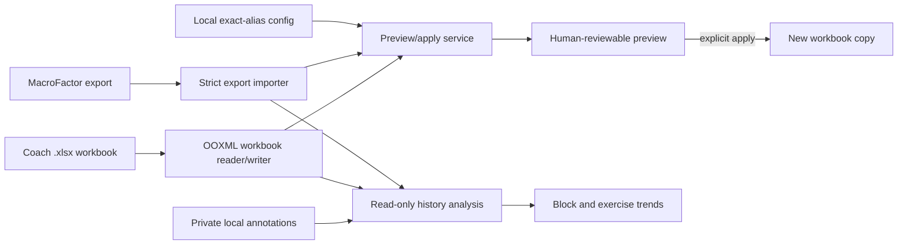

# MacroFactor Workout Bridge

[](https://github.com/joshuawyadao/MacroFactor-Workout-Bridge/actions/workflows/ci-verify.yml)
[](https://www.python.org/)
[](https://www.apple.com/macos/)
[](LICENSE)

MacroFactor Workout Bridge is a conservative local macOS application for weekly workbook transfer and read-only workout-history review. It copies completed results from a MacroFactor exercise-log export into a selected week of a coach's Excel workbook, and it can summarize an all-time export alongside the workbook's training-block worksheets. It includes a double-clickable graphical app and an optional command-line interface for the transfer workflow.

The supported write direction remains intentionally narrow:

**MacroFactor exercise log → coach `.xlsx` workbook**

The Workout History tab never changes either source. The app does not create or import MacroFactor programs.

> **Project status:** Source-first personal utility. It processes files locally, has no hosted backend, and does not distribute a signed or notarized binary.

## Engineering highlights

- **Preview before write:** every proposed workbook change is shown before an output can be created.
- **Immutable inputs:** source hashes are checked around apply, and output must use a distinct path that does not already exist.
- **Surgical OOXML edits:** only the selected worksheet XML and, for highlighted review markers, `xl/styles.xml` may change; every other workbook part must remain byte-identical.
- **Conservative matching:** exercise names use exact normalized aliases, with no fuzzy or inferred matches.
- **Reviewable ambiguity:** duplicates, occupied cells, zero-rep rows, unsupported data, and unmatched exercises are reported instead of guessed.
- **Local-first privacy:** the app and CLI do not upload workout or workbook data and have no runtime network dependency.
- **Read-only history:** coach worksheets become ordered block summaries while MacroFactor sets remain grouped by their recorded calendar weeks.
- **Explicit context:** private local annotations distinguish planned, fatigue, vacation, injury, illness, and other modified weeks without guessing why training changed.
- **Reproducible verification:** anonymized fixtures cover parsing, formatting, workbook integrity, desktop behavior, and packaged-app smoke behavior.

## Architecture



```text
src/macrofactor_bridge/  Import, history, annotations, matching, OOXML, service, CLI, and desktop workflows
packaging/               PyInstaller entry point, specification, and icon generation
scripts/                 Reproducible local macOS application build
config/                  Synthetic example exercise mapping
tests/                   Unit, integration, GUI, and anonymized workbook fixtures
```

## Privacy and security

- Real MacroFactor exports, coach workbooks, dashboard annotations, generated reports, application outputs, local mappings, and local workspaces are excluded from Git.
- Only deliberately anonymized fixtures under `tests/fixtures/` may be committed.
- The application processes selected files on the local machine and does not transmit their contents.
- The build script downloads declared Python build dependencies, but the built application has no runtime network integration.
- The local `.app` is ad-hoc signed. It is not Developer ID signed, Apple-notarized, or suitable for trusted direct-download distribution.

See the [Security Policy](SECURITY.md) to report a vulnerability privately. Never attach real workout or workbook data, credentials, or unredacted local paths to a public issue.

## Safety model

- Preview is read-only and shows every proposed write before an output workbook is created.
- Apply writes to a separate output path and refuses to use the coach workbook as the output path.
- Apply refuses to overwrite an existing output file.
- Only existing, empty result cells are eligible. Existing values and formulas are always skipped.
- The source workbook and MacroFactor export are hashed before and after apply; a hash mismatch fails the operation.
- The output keeps the same ZIP member list. Every workbook part except the selected worksheet XML and, when highlighted review markers are written, `xl/styles.xml` must remain byte-identical.
- Normal result updates retain the target cell's style. Highlighted review markers change only the fill while retaining the font, border, alignment, and number format, including formatting inherited from a row or column when the cell has no explicit style. Formulas, merged cells, relationships, drawings, and workbook structure remain intact. Edited XML retains namespace declaration scopes, including prefixes used only by compatibility attributes.
- Exercise matching is exact after case and whitespace normalization plus configured aliases. There is no fuzzy matching.
- When enabled in the mapping, a programmed day with no matched session receives a yellow `Skip` review marker. It is a visual prompt to confirm the absence, not proof that MacroFactor recorded a skip.
- Zero-rep rows are ignored and reported.
- Workout History reads the selected export and workbook without writing to either one. Its only write is an explicitly saved private annotation JSON file.
- Missing block dates and RIR values remain missing. The dashboard reports reduced coverage instead of inferring them.

The application never changes the MacroFactor export.

## Private local file workspace

For recurring use, keep personal inputs and generated files under the Git-ignored `local-data/` directory instead of Downloads:

```bash
PYTHONPATH=src python3 -m macrofactor_bridge.local_workspace setup
```

Drop coach workbooks into `local-data/inbox/coach/` and MacroFactor exercise-log exports into `local-data/inbox/macrofactor/`, then validate and archive them. Keep their downloaded names; no manual renaming is needed:

```bash
PYTHONPATH=src python3 -m macrofactor_bridge.local_workspace archive \
  --config config/exercises.local.json
PYTHONPATH=src python3 -m macrofactor_bridge.local_workspace status
```

Every validated copy starts with its UTC upload/intake date for easy searching. MacroFactor names also include their workout-date range, and all archive names include a content hash. Stable files under `local-data/current/` point to the current weekly-transfer inputs. Every run creates a JSON manifest, identical content is deduplicated, and inbox files are never moved, deleted, renamed, or changed. Save app outputs under `local-data/generated/` and dashboard context under `local-data/annotations/`. See [Local File Workflow](docs/Local-File-Workflow.md) for the directory layout, naming examples, weekly and history routines, privacy rules, and recovery limitations.

Exports must contain at least one usable completed set. Malformed history entries are skipped, and moving the whole workspace preserves archive selection and status paths. Custom `--root` locations receive local Git ignore rules for all managed data directories, including private manifests and reports; existing tracked files are not automatically untracked.

## Use the macOS app

After a local build, the application is at:

```text
dist/MacroFactor Workout Bridge.app
```

Open Finder, navigate to `dist`, and double-click **MacroFactor Workout Bridge**. The app is self-contained; using the built app does not require Python or Terminal.

The **Weekly Bridge** tab guides the safe workbook workflow:

1. Choose the MacroFactor `.csv` or `.xlsx` exercise-log export.
2. Choose the coach `.xlsx` workbook.
3. Use the bundled exercise mapping, or save an editable JSON copy and select it.
4. Click **Discover**, then select the worksheet and coach week.
5. Confirm the inclusive workout dates. **Use latest export week** selects Monday through Sunday around the export's latest workout row; it does not infer that an absent workout was skipped.
6. Click **Preview workbook changes** and inspect the proposed-change table and **Review needed** panel. Yellow `Skip` rows call out programmed days with no matched session and must be confirmed before sharing.
7. Click **Create safe workbook copy…** and choose a new `.xlsx` filename.
8. Optionally save the full review and validation report as JSON.

The bundled mapping is an example, not a promise that every personal exercise name is configured. Use **Save editable copy…** to create a normal JSON file outside the repository, add exact aliases and confirmed conversions, then preview again. The app never edits the mapping stored inside its bundle.

### Review workout history

The **Workout History** tab is a separate read-only workflow:

1. Choose an all-time MacroFactor exercise-log export, the newest coach workbook, and the exercise mapping.
2. Leave the suggested private annotation path under `local-data/annotations/`, or select an existing annotation JSON file.
3. Click **Load history dashboard**. The overview reports usable sets, workout and training-day counts, RIR coverage, and workout duration without changing either source.
4. Review coach worksheets as blocks in their existing Excel tab order. Each block reports its discovered weeks and populated result cells.
5. Choose an exercise to review calendar-week training days, sets, top load, Epley estimated 1RM, volume load, average recorded RIR, and a compact estimated-strength trend.
6. Optionally confirm a block type and start date, then annotate a coach week as normal, deload/re-entry, or modified. Reasons distinguish planned or fatigue-driven changes from vacation, injury, illness, and other context.

Block dates are never inferred from worksheet names or gaps in training. Until a start date is confirmed, dated workouts remain visible by calendar week but are not assigned to that block. When a start is known, consecutive seven-day ranges map to the workbook's discovered week labels. Calendar trends use Monday–Sunday; confirming a Monday start aligns block weeks with those trends. A missing workout never shifts later weeks or becomes an inferred skip.

For irregular worksheets with copied historical columns or date-labelled weeks, an optional private `week_layout` selects the exact headers in chronological order. Counts, date ranges, and the week-note selector then use only those weeks. Source headers are checked on every load, and a changed or missing header stops loading rather than silently remapping history. The Weekly Bridge is unaffected. See [custom history layouts](docs/Local-File-Workflow.md#irregular-coach-week-layouts) for the advanced JSON configuration and version requirements.

Estimated 1RM is a descriptive Epley estimate from weighted standard sets of 1–12 reps. Drop, mini, and myo sets are excluded from that estimate; all completed positive-rep sets still contribute to set, repetition, and per-exercise volume summaries. It is not an injury assessment, readiness score, work-capacity prescription, or deload prediction.

MacroFactor's `RIR` and `Workout Duration` columns are optional. RIR coverage is reported rather than imputed, and numeric workout duration is interpreted as seconds and counted once per workout even though the export repeats it on each set row. The export does not contain a separate actual-RPE column.

### Requirements

- macOS 13 or newer on Apple silicon
- Python 3.11 or newer to build from source
- A MacroFactor exercise-log export in `.csv` or `.xlsx` format
- A coach workbook in `.xlsx` format

The importer accepts MacroFactor's exact pound-weight headers `Weight (lb)` and `Weight (lbs)`. Other unit labels remain unsupported so a unit change cannot silently alter workout results.

### Build locally

The first build requires internet access so the isolated environment can install the reviewed PySide6 and PyInstaller dependency closure:

```sh
./scripts/build_macos_app.sh
```

The script recreates its isolated build environment before every build, creates `dist/MacroFactor Workout Bridge.app`, embeds Python and Qt, generates the app icon, applies an ad-hoc signature, and verifies the bundle. Recreating the environment ensures every bundled dependency passes the reviewed lockfile's wheel-hash checks instead of reusing an already-installed package. Build environments and application artifacts are excluded from Git.

The app-build dependency closure is pinned in `requirements/app-build.lock`; the direct optional dependencies in `pyproject.toml` use the same PySide6 and PyInstaller versions. Every installable artifact is restricted to a reviewed wheel SHA-256 digest, and the build fails closed if a version, hash, or binary wheel does not match. Update this lockfile only as a tested unit: resolve it on Python 3.11, record the selected macOS wheel hashes from PyPI, run `python -m pip check`, audit the closure, rebuild the app, and run the offscreen GUI suite. The command-line package deliberately has no runtime dependencies.

Because the app is built locally, it should open normally on that Mac. A copied or downloaded build is not Apple-notarized; macOS may require Control-clicking the app, choosing **Open**, and confirming **Open**. Developer ID signing and notarization are outside the current project.

## Optional command-line workflow

Create a virtual environment and install the project:

```sh
python3 -m venv .venv
.venv/bin/python -m pip install -e .
```

Run `macrofactor-bridge`, or use the source tree without installation:

```sh
PYTHONPATH=src python3 -m macrofactor_bridge --help
```

### Configure exercise mappings

Copy the synthetic example and edit the ignored local file:

```sh
cp config/exercises.example.json config/exercises.local.json
```

Each mapping rule follows this shape:

```json
{
  "canonical": "Dumbbell Walking Lunge",
  "source_aliases": ["Dumbbell Walking Lunge"],
  "coach_aliases": ["Walking Lunge"],
  "weight_multiplier": 0.5,
  "weight_suffix": "s"
}
```

The workbook section can optionally enable an empty-day review marker:

```json
{
  "empty_day_marker": {
    "text": "Skip",
    "fill_color": "FFFF00"
  }
}
```

The marker is proposed only when the selected dates contain usable workout data, the programmed day has no matched result, the target cell is empty, and no unmatched, ambiguous, zero-rep, or otherwise unusable rows make the absence uncertain. The yellow fill is preserved in the generated workbook while the cell's existing font, border, alignment, and number format remain intact.

- `source_aliases` are exact names accepted from the MacroFactor export.
- `coach_aliases` are exact names accepted in the workbook's exercise column.
- `coach_context_aliases` optionally disambiguate repeated exercise-column labels by requiring an exact match in another text cell on the same row. For example, `Abs` can be paired with the exact variation `hanging leg raises (3ct tempo eccentric)` without selecting a separate GHD sit-up row.
- `weight_multiplier` defaults to `1`. Set it to `0.5` only for a confirmed per-side exercise.
- `weight_suffix` defaults to an empty string and is independent of weight conversion.
- `superset_group` and `superset_order` let multiple configured exercises write one target cell with `/` in configured order.

There is deliberately no general dumbbell, cable, plate-loaded, or machine conversion rule.

### Discover worksheets and weeks

```sh
PYTHONPATH=src python3 -m macrofactor_bridge inspect \
  --workbook "/path/to/Coach_Program.xlsx" \
  --config config/exercises.local.json
```

Worksheet names, week labels, header rows, and result columns are discovered from the workbook rather than fixed in code. The default configuration recognizes an exercise column headed `Variation` or `Exercise` and week headings matching `Week <number>`. Repeated headers for the same week and result column are consolidated. A merged week header uses its rightmost column as the result column; an unmerged header uses the adjacent column.

### Preview changes

Use an explicit inclusive date range so results cannot be assigned to a coach week accidentally:

```sh
PYTHONPATH=src python3 -m macrofactor_bridge preview \
  --export "/path/to/MacroFactor-Exercise_Log.xlsx" \
  --workbook "/path/to/Coach_Program.xlsx" \
  --config config/exercises.local.json \
  --sheet "Training Block" \
  --week "Week 1" \
  --from-date 2026-08-03 \
  --to-date 2026-08-09 \
  --report reports/week-1-preview.json
```

Omit `--sheet` or `--week` to choose from an interactive numbered list.

Preview reports:

- proposed cell values;
- unmatched source exercises;
- configured aliases matching multiple workbook rows;
- exercises appearing in multiple workout sessions in the selected date range;
- zero-rep and missing-rep rows;
- occupied result cells;
- missing or unsupported data;
- relevant exercise-level notes found in MacroFactor's `Active Program` table. Notes are review-only and are not appended to result cells.
- yellow empty-day `Skip` markers that require confirmation before the workbook is shared.

### Create an output workbook

After reviewing the preview, repeat the selection with `apply` and provide a new output filename:

```sh
PYTHONPATH=src python3 -m macrofactor_bridge apply \
  --export "/path/to/MacroFactor-Exercise_Log.xlsx" \
  --workbook "/path/to/Coach_Program.xlsx" \
  --config config/exercises.local.json \
  --sheet "Training Block" \
  --week "Week 1" \
  --from-date 2026-08-03 \
  --to-date 2026-08-09 \
  --output outputs/Coach_Program-week-1.xlsx \
  --report reports/week-1-apply.json
```

Apply refuses to create an output when there are no proposed writes.

## Result formatting

- Completed sets: `weight x reps`
- Repeated weight: `200 x 8, 7`
- Weight changes: `200 x 8, 7; 180 x 10`
- Myo and mini sets: `160 x 10+3+2`
- Supersets: `50/60 x 10/12, 9/11`
- Superset weight changes: `50/60 x 10/12; 50/55 x 9/11`
- Drop sets: `100 x 8→70 x 10`
- Bodyweight or blank MacroFactor weight: `0 x reps`
- Configured per-side conversion plus suffix: `45s x 12`

## Verification

Run the complete source and graphical suite:

```sh
./scripts/test.sh
python3 -m compileall -q src tests packaging
git diff --check
```

CI installs its dependency-audit tooling from a separate reviewed closure, then audits that tooling and both application dependency closures for known Python-package vulnerabilities. To run the same check locally:

```sh
python3.11 -m venv --clear .venv/audit
.venv/audit/bin/python -m pip install \
  --only-binary=:all: \
  --require-hashes \
  --requirement requirements/audit.lock
.venv/audit/bin/python -m pip_audit \
  --disable-pip \
  --require-hashes \
  --requirement requirements/audit.lock \
  --requirement requirements/app-build.lock \
  --requirement requirements/test.lock
```

The audit is read-only and reports publicly known advisories; it does not update dependencies automatically. Use Python 3.11 for this workflow because `requirements/audit.lock` pins the complete `pip-audit` closure and records the reviewed Python 3.11 Linux x86-64 and Apple-silicon macOS wheel hashes. Hash checking guarantees that pip accepts only the reviewed wheel artifacts recorded in the locks.

The first test run creates an environment under the primary project checkout's already-ignored `.venv/worktree-tests/` directory and requires internet access unless the pinned, hash-verified wheels are already cached. Its directory name contains the Python version and SHA-256 fingerprint of `requirements/test.lock`: worktrees with the same test dependencies reuse one environment, while branches with different locks cannot modify an environment used by another test run. Linked Git worktrees discover the shared root through Git's common directory, and the runner always prepends the launching worktree's `src/` directory to `PYTHONPATH`.

Use `MACROFACTOR_TEST_VENV_ROOT=/absolute/path` to override the directory containing fingerprinted environments. Existing files directly inside `.venv` remain available to the primary checkout; the runner manages only its `worktree-tests/` child. To run only tests that do not require the optional graphical dependency, bypass the runner:

```sh
PYTHONPATH=src python3 -m unittest discover -s tests -v
```

After building the application, verify its embedded Qt runtime:

```sh
QT_QPA_PLATFORM=offscreen \
  "dist/MacroFactor Workout Bridge.app/Contents/MacOS/MacroFactor Workout Bridge" \
  --smoke-test
```

GitHub-hosted CI runs the complete Python and offscreen desktop test suite for non-draft pull requests and manual dispatches. Draft pull requests do not reserve a runner; marking one ready for review starts verification. A newer update to the same pull request cancels superseded work, and merging does not repeat the same suite on `main`. Use the Actions tab's manual **CI Verify** dispatch when a hosted rerun is needed.

The suite uses small anonymized workbooks and verifies parsing, formatting, exact matching, reports, desktop defaults and controls, dynamic worksheet/week discovery, empty-cell enforcement, source immutability, style/formula/merge preservation, and byte-identical unrelated workbook parts. Direct source-only runs skip the GUI test when PySide6 is unavailable; the canonical runner provisions it and executes the test.

## Known limitations

- Coach workbooks must be `.xlsx`; macro-enabled `.xlsm` files are not supported.
- A target result cell must already exist in the worksheet XML. The application skips a completely absent cell instead of creating one without a trustworthy style.
- One source exercise may appear in only one workout session within the selected date range. Repeated sessions are reported as ambiguous rather than merged.
- Superset exercises must share one configured target and superset group, contain the same number of completed standard sets, and are paired by set position in configured exercise order.
- Current MacroFactor `.xlsx` exports expose exercise-level notes in `Active Program`, but the `Workout Log` table does not expose program-level or session-level notes. Exercise notes appear in review output only and represent the current active-program value rather than a historical note attached to one completed set.
- Workout History requires the user to select an all-time export when long-range trends are desired. The stable current MacroFactor link may intentionally point to a narrower, more recent export used by the weekly bridge.
- Worksheet titles identify blocks, but exact block-to-calendar mapping requires a confirmed start date in the private annotation file.
- Recovery context is descriptive only. The app does not predict deload timing, infer whether a change was caused by fatigue, or treat vacation and injury as evidence of exceeded work capacity.
- Unsupported duration- or distance-only sets without reps are reported and skipped.
- The application does not calculate formulas or change cached formula results.
- The `.app` build targets Apple silicon and is locally signed but not Apple-notarized.
- Fuzzy exercise matching and reverse coach-program import are intentionally outside the current scope.

## Contributing

Issues and pull requests are welcome. Read [CONTRIBUTING.md](CONTRIBUTING.md) and the [Code of Conduct](CODE_OF_CONDUCT.md) before participating. Report conduct concerns through the private channel in the [Code of Conduct](CODE_OF_CONDUCT.md#enforcement). Follow the [Security Policy](SECURITY.md#reporting-a-vulnerability) for vulnerabilities: never publish exploit or sensitive details, but if private vulnerability reporting is unavailable, a sanitized public issue may request a private contact channel.

## License

Released under the [MIT License](LICENSE). MacroFactor is a product of Stronger By Science Technologies LLC; this independent project is not affiliated with or endorsed by MacroFactor.
