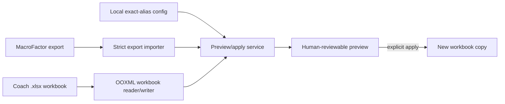

# MacroFactor Workout Bridge

[](https://github.com/joshuawyadao/MacroFactor-Workout-Bridge/actions/workflows/ci-verify.yml)
[](https://www.python.org/)
[](https://www.apple.com/macos/)
[](LICENSE)

MacroFactor Workout Bridge is a conservative local tool for reviewing and transferring workout data between MacroFactor exports and a coach's Excel workbook. Part 1 copies completed workout results into a selected coach week through the double-clickable macOS app or CLI. Part 2 provides a CLI-only preview and a gated generator for the narrow workbook structure proved by a direct MacroFactor program export.

The established Part 1 write direction remains intentionally narrow:

**MacroFactor exercise log → coach `.xlsx` workbook**

Part 2 can create a new candidate program workbook only when its preview has no blockers and the coach selection matches the verified template structure. MacroFactor import remains a manual action, and compatibility is not claimed until a generated file imports successfully.

> **Project status:** Source-first personal utility. It processes files locally, has no hosted backend, and does not distribute a signed or notarized binary.

## Engineering highlights

- **Preview before write:** every proposed workbook change is shown before an output can be created.
- **Immutable inputs:** source hashes are checked around apply, and output must use a distinct path that does not already exist.
- **Surgical OOXML edits:** only the selected worksheet XML and, for highlighted review markers, `xl/styles.xml` may change; every other workbook part must remain byte-identical.
- **Conservative matching:** exercise names use exact normalized aliases, with no fuzzy or inferred matches.
- **Reviewable ambiguity:** duplicates, occupied cells, zero-rep rows, unsupported data, and unmatched exercises are reported instead of guessed.
- **Local-first privacy:** the app and CLI do not upload workout or workbook data and have no runtime network dependency.
- **Reproducible verification:** anonymized fixtures cover parsing, formatting, workbook integrity, desktop behavior, and packaged-app smoke behavior.

## Architecture



```text
src/macrofactor_bridge/  Import, matching, formatting, OOXML, service, CLI, and desktop workflow
packaging/               PyInstaller entry point, specification, and icon generation
scripts/                 Reproducible local macOS application build
config/                  Synthetic example exercise mapping
tests/                   Unit, integration, GUI, and anonymized workbook fixtures
```

## Privacy and security

- Real MacroFactor exports, coach workbooks, generated reports, application outputs, local mappings, and local workspaces are excluded from Git.
- Only deliberately anonymized fixtures under `tests/fixtures/` may be committed.
- The application processes selected files on the local machine and does not transmit their contents.
- The build script downloads declared Python build dependencies, but the built application has no runtime network integration.
- The local `.app` is ad-hoc signed. It is not Developer ID signed, Apple-notarized, or suitable for trusted direct-download distribution.

See the [Security Policy](SECURITY.md) to report a vulnerability privately. Never attach real workout or workbook data, credentials, or unredacted local paths to a public issue.

## Safety model

- Preview is read-only and shows every proposed write before an output workbook is created.
- Apply writes to a separate output path and refuses to use the coach workbook as the output path.
- Apply refuses to overwrite an existing output file.
- Only existing, empty result cells are eligible. Existing values and formulas are always skipped.
- The source workbook and MacroFactor export are hashed before and after apply; a hash mismatch fails the operation.
- The output keeps the same ZIP member list. Every workbook part except the selected worksheet XML and, when highlighted review markers are written, `xl/styles.xml` must remain byte-identical.
- Normal result updates retain the target cell's style. Highlighted review markers change only the fill while retaining the font, border, alignment, and number format, including formatting inherited from a row or column when the cell has no explicit style. Formulas, merged cells, relationships, drawings, and workbook structure remain intact. Edited XML retains namespace declaration scopes, including prefixes used only by compatibility attributes.
- Exercise matching is exact after case and whitespace normalization plus configured aliases. There is no fuzzy matching.
- When enabled in the mapping, a programmed day with no matched session receives a yellow `Skip` review marker. It is a visual prompt to confirm the absence, not proof that MacroFactor recorded a skip.
- Zero-rep rows are ignored and reported.

The application never changes the MacroFactor export.

## Private local file workspace

For recurring use, keep personal inputs and generated files under the Git-ignored `local-data/` directory instead of Downloads:

```bash
PYTHONPATH=src python3 -m macrofactor_bridge.local_workspace setup
```

Drop coach workbooks into `local-data/inbox/coach/` and MacroFactor exercise-log exports into `local-data/inbox/macrofactor/`, then validate and archive them. Keep their downloaded names; no manual renaming is needed:

```bash
PYTHONPATH=src python3 -m macrofactor_bridge.local_workspace archive \
  --config config/exercises.local.json
PYTHONPATH=src python3 -m macrofactor_bridge.local_workspace status
```

Every validated copy starts with its UTC upload/intake date for easy searching. MacroFactor names also include their workout-date range, and all archive names include a content hash. Stable files under `local-data/current/` always point to the versions to select in the app. Every run creates a JSON manifest, identical content is deduplicated, and inbox files are never moved, deleted, renamed, or changed. Save app outputs under `local-data/generated/`. See [Local File Workflow](docs/Local-File-Workflow.md) for the directory layout, naming examples, weekly routine, privacy rules, and recovery limitations.

Exports must contain at least one usable completed set. Malformed history entries are skipped, and moving the whole workspace preserves archive selection and status paths. Custom `--root` locations receive local Git ignore rules for all managed data directories, including private manifests and reports; existing tracked files are not automatically untracked.

## Use the macOS app

After a local build, the application is at:

```text
dist/MacroFactor Workout Bridge.app
```

Open Finder, navigate to `dist`, and double-click **MacroFactor Workout Bridge**. The app is self-contained; using the built app does not require Python or Terminal.

The app guides one workflow:

1. Choose the MacroFactor `.csv` or `.xlsx` exercise-log export.
2. Choose the coach `.xlsx` workbook.
3. Use the bundled exercise mapping, or save an editable JSON copy and select it.
4. Click **Discover**, then select the worksheet and coach week.
5. Confirm the inclusive workout dates. **Use latest export week** selects Monday through Sunday around the export's latest workout row; it does not infer that an absent workout was skipped.
6. Click **Preview workbook changes** and inspect the proposed-change table and **Review needed** panel. Yellow `Skip` rows call out programmed days with no matched session and must be confirmed before sharing.
7. Click **Create safe workbook copy…** and choose a new `.xlsx` filename.
8. Optionally save the full review and validation report as JSON.

The bundled mapping is an example, not a promise that every personal exercise name is configured. Use **Save editable copy…** to create a normal JSON file outside the repository, add exact aliases and confirmed conversions, then preview again. The app never edits the mapping stored inside its bundle.

### Requirements

- macOS 13 or newer on Apple silicon
- Python 3.11 or newer to build from source
- A MacroFactor exercise-log export in `.csv` or `.xlsx` format
- A coach workbook in `.xlsx` format

The importer accepts MacroFactor's exact pound-weight headers `Weight (lb)` and `Weight (lbs)`. Other unit labels remain unsupported so a unit change cannot silently alter workout results.

### Build locally

The first build requires internet access so the isolated environment can install the reviewed PySide6 and PyInstaller dependency closure:

```sh
./scripts/build_macos_app.sh
```

The script recreates its isolated build environment before every build, creates `dist/MacroFactor Workout Bridge.app`, embeds Python and Qt, generates the app icon, applies an ad-hoc signature, and verifies the bundle. Recreating the environment ensures every bundled dependency passes the reviewed lockfile's wheel-hash checks instead of reusing an already-installed package. Build environments and application artifacts are excluded from Git.

The app-build dependency closure is pinned in `requirements/app-build.lock`; the direct optional dependencies in `pyproject.toml` use the same PySide6 and PyInstaller versions. Every installable artifact is restricted to a reviewed wheel SHA-256 digest, and the build fails closed if a version, hash, or binary wheel does not match. Update this lockfile only as a tested unit: resolve it on Python 3.11, record the selected macOS wheel hashes from PyPI, run `python -m pip check`, audit the closure, rebuild the app, and run the offscreen GUI suite. The command-line package deliberately has no runtime dependencies.

Because the app is built locally, it should open normally on that Mac. A copied or downloaded build is not Apple-notarized; macOS may require Control-clicking the app, choosing **Open**, and confirming **Open**. Developer ID signing and notarization are outside the current project.

## Optional command-line workflow

Create a virtual environment and install the project:

```sh
python3 -m venv .venv
.venv/bin/python -m pip install -e .
```

Run `macrofactor-bridge`, or use the source tree without installation:

```sh
PYTHONPATH=src python3 -m macrofactor_bridge --help
```

### Preview and generate a coach program for Part 2

Part 2 begins with a separate, read-only preview path. It discovers repeated day sections and uses the explicit `program.week_pair_layout` setting (`plan_then_result` or `result_then_plan`) to identify planned and completed-result columns within each structurally proven week pair. Without that setting, no week is considered safe to preview. The parser never reads the configured completed-result column as a prescription.

List selectable worksheets, program blocks, days, and safely separated weeks:

```sh
PYTHONPATH=src python3 -m macrofactor_bridge program-inspect \
  --workbook "/path/to/Coach_Program.xlsx" \
  --config config/exercises.local.json
```

Preview one or more included weeks and optionally save a private JSON report:

```sh
PYTHONPATH=src python3 -m macrofactor_bridge program-preview \
  --workbook "/path/to/Coach_Program.xlsx" \
  --config config/exercises.local.json \
  --template local-data/reference/macrofactor-program/template.xlsx \
  --sheet "Selected worksheet" \
  --block block-1 \
  --week "Week 1" \
  --week "Week 2" \
  --report local-data/generated/reports/program-preview.json
```

Report paths must be new files and cannot reuse an input or generated workbook path; the CLI refuses to overwrite an existing report.

The preview contains discovered days and exercises, exact mapping outcomes, per-cycle set count/type/reps/RIR/rest, source-cell and raw-text provenance, proposed configuration defaults, explicit exclusions, custom or unavailable MacroFactor exercises, supersets, skipped items, blockers, source and template hashes, schema-verification state, and whether generation is safe. Omitting `--template` keeps the preview available but adds a blocking missing-template issue.

Parsing is deliberately allow-listed. Base sets must be positive integers. Reps can be a single value, a range such as `8-12` or `8 to 12 reps`, or a comma-separated positive per-set list whose length matches the set count. Single numbers become equal minimum/maximum targets. Explicit `ea`/`each` suffixes (optionally `leg`/`side`) mean per-side reps; a trailing `again` preserves the preceding exact target. `N+ reps` has a minimum but no maximum: native generation remains blocked until a direct export verifies minimum-only encoding, unless the user explicitly enables the notes-only fallback below. Rest needs an explicit seconds or minutes unit. Weekly cells may use compact instructions such as `3 x 8-10 @ 2 RIR, 120 sec rest`. `Read week`, `your choice`, RPE, AMRAP, weights, substitutions and progression prose remain raw and blocking unless an explicit notes/blank policy applies.

The coach `Style` column is preserved as raw classification text. The separate `Variation` column is retained and used for exact exercise matching and context. A specific variation must match an exact alias/canonical name or a category alias with matching configured context; an unqualified category mapping from another block cannot replace it. A single block-wide week header may serve later days with matching base columns and proven plan/result pairs. Header inheritance stops when day numbers reset or the base layout changes.

Within a discovered day, the exercise table begins at the first exercise and ends when all base columns are blank. Standalone weekly footer notes do not extend the exercise table into later reference sections. Review discovered boundaries before generation.

The optional top-level `program.defaults` object can propose rep, RIR, and rest values. Defaults are disabled by `null`, never replace coach-provided values, and are labeled `config_default` in preview. Rep defaults require both `rep_min` and `rep_max`. Set `program.week_pair_layout` only after verifying whether each week pair is planned-then-result or result-then-planned in that coach workbook.

#### Initial base program and workout names

Use `program.prescription_source: "base"` when the left-hand table defines the initial program and weekly coach updates will be handled separately. Each selected week adds one cycle repeating the base prescription. Omitting `--week` in this mode selects all safely discovered weeks in the chosen block; explicit `--week` arguments limit the duration. The CLI prints the source mode and cycle count. Weekly coach text stays in the private report with `weekly_update_not_applied` warnings, but cannot supply targets, set types, mapping context, exclusions or exported notes. Completed results are never prescription inputs. This is a repeated base program, not automatic weekly progression. The default `"selected_week"` mode retains existing conflict checks.

Set `program.use_day_designations: true` to name exported workouts from the unique text beneath each day heading in the same discovered column. The report preserves the original identifier (including fractional days), full designation and source cell. No sheet, row or column is hard-coded. Missing designations use the original label; ambiguous or formula-driven designations warn and fall back without borrowing another day's title.

#### Reviewed corrections and concise notes

`program.notes_mode: "concise"` with `preserve_coach_notes: true` omits redundant structured-field dumps and import-setting boilerplate from exported notes. The private report still retains source values, weekly text and policy provenance. Unresolved targets and unilateral cues remain in notes. Exact-rule `program_notes` can supply a reviewed list of residual technique/equipment cues (an empty list removes redundant variation text). This replaces only the variation note, not unresolved target guidance. Without that list, unmatched variation wording is retained conservatively. The default `"full"` mode is unchanged.

`program.minimum_rep_policy: "notes_only"` requires both `allow_blank_targets: true` and `preserve_coach_notes: true`. Exact `15` still exports as `15 - 15`; a minimum such as `15+ reps` instead has **blank rep targets** and an explicit exercise note retaining the original text for manual entry. Preview marks this policy with `minimum_reps_in_notes`, retains raw text and identifies the blanks as policy choices. Reviewed concise notes cannot remove this guidance. Defaults do not supply an invented maximum, and weekly conflicts still block. The default policy is `"block"`. This fallback is not native minimum-only support.

Optional `program.color` and `program.icon` override uniquely discovered template metadata cells. Omit them (or use null) to preserve the template. Currently verified override tokens are colors `Orange`/`Red` and icons `Chess Pawn`/`Rocket`, observed in direct exports—not a complete app catalog. For example, `"color": "Red", "icon": "Rocket"` provides a consistent growth-program theme. Preview identifies configured overrides; missing or ambiguous metadata and unverified override values block. No workbook styles are recolored, and the production runtime remains Python/OOXML. Confirm the displayed appearance during manual import.

Keep corrections in a block-specific ignored Part 2 configuration, separate from Part 1. An exercise rule may use `program_include_warmup: true` for an explicitly reviewed warmup-classified strength exercise. It does not bypass cardio, mapping, custom-exercise, set-type or template checks, and cannot accompany `program_excluded: true`.

For a reviewed base-cell correction, `program_base_overrides` accepts only `sets` and `reps`, with both an exact `expected` source string and a supported replacement `value`:

```json
"program_base_overrides": {
  "sets": {"expected": "2", "value": "4"},
  "reps": {"expected": "See instructions", "value": "7-11"}
}
```

Corrections carry `config_reviewed_override` provenance and warnings. A changed source string blocks as `stale_base_override`; unsupported replacements remain blocked even with blank-target policy. Date-formatted rep cells still require human review rather than interpreting a date serial as reps. No correction changes the coach workbook.

#### Reviewed sequential exercises from one row

In base-prescription mode, one exact exercise rule can explicitly expand a combined coach row into **two independent, ordered exercises**. Each child requires its own exact MacroFactor name and positive set count; the count is for that child, not a total to divide. Keep this block-specific configuration private:

```json
"program_expansion": {
  "expected_variation": "Coach combined movement",
  "expected_sets": "2",
  "exercises": [
    {"canonical": "Synthetic First", "sets": 2},
    {"canonical": "Synthetic Second", "sets": 2}
  ]
}
```

Both guards must match literal source text exactly. Preview retains the original row/cells/raw text, reports `exact_expansion`, child order and `config_program_expansion` set-count provenance, and shows a review warning. Shared rep/rest/RIR targets and notes are preserved. No superset is inferred. Stale/formula-driven guards, per-set rep lists, special-set sequences and source supersets block rather than allocating them. Configured supersets, set-count overrides and inclusion/exclusion exceptions cannot accompany expansion. Optional child `macrofactor_custom`/`macrofactor_available` booleans retain the existing warning/blocking behavior; specify these on each child, not the parent. Child names do not enter Part 1's result alias index.

#### Other import policies

For an import that carries coaching instructions in notes and leaves unspecified targets editable, these opt-in settings are available:

```json
{
  "program": {
    "week_pair_layout": "plan_then_result",
    "sheet_order": "right_to_left",
    "rest_range_policy": "upper",
    "set_count_range_policy": "upper",
    "allow_blank_targets": true,
    "preserve_coach_notes": true,
    "exclude_warmups": true,
    "exclude_cardio": true,
    "resize_template_workouts": true,
    "defaults": {"set_type": "standard"}
  }
}
```

`right_to_left` lists the last worksheet first; it does not infer dates from worksheet names. All discovered days and optional exercises remain included unless explicitly excluded. `upper` selects the upper end of an exact rest range and identifies that choice in field provenance and notes. `allow_blank_targets` leaves missing reps, RIR, and rest blank when no explicit configured default is present. With `preserve_coach_notes`, `Read week` rep instructions remain deferred, unsupported rep instructions stay in notes with blank targets, and full base/selected-week coaching text is retained in the template's exercise Notes field. RPE is never converted to RIR. Bare numbers in weekly cells are retained as instructions rather than interpreted as rep targets, because they may be weights. Excel date-formatted rep cells are flagged and never emitted as serial-number rep targets.

`set_count_range_policy: "upper"` selects the upper end of an exact base set-count range such as `2–3` or `3 to 4 sets`. The preview labels that choice `coach_range_upper_by_policy`; Notes retain the original range and selected total when notes are enabled. Exact weekly set counts still undergo conflict checking, and the total must fit the verified template's set capacity. Malformed ranges and prose remain blocked. The default policy is `"block"`.

`unitless_rest_policy: "seconds"` explicitly interprets positive integers in the **base Rest column** as seconds. The default remains `"block"`. Unitless ranges additionally require `rest_range_policy: "upper"`. Preview preserves the source cell/raw value, emits a policy warning, and uses distinct `coach_unitless_seconds_by_policy` or `coach_unitless_seconds_range_upper_by_policy` provenance. Explicit minute/second units take precedence; weekly bare numbers never inherit this policy. Repeated-unit ranges such as `75 sec to 105 sec` and exact ceilings such as `120 sec max` are supported; mixed units, reversed ranges and arbitrary prose remain blocked. Ceiling and `(timed)` cues survive concise exercise notes.

Literal unilateral set counts such as `2 each leg` mean two sets per side, not four. They retain coach-source provenance and a per-side note. A configured native superset gives **each movement** the full resolved count; combined text alone does not choose exercise identities or establish membership/order. Previously reviewed sequential `program_expansion` rules remain sequential.

The standard-set default is explicit and visible. Myo/drop/superset instructions override the default and stay subject to verified template support; explicit configured superset membership supplies the group and order. Unresolved exercise identities and conflicting exact values remain blockers. These settings do not change Part 1 or weaken the strict parser configuration used by existing workflows. Part 1's `+` formatting for completed myo-rep results is not a native program set-type encoding.

A second direct export verifies the literal `Myo Set` value alongside `Standard Set`. An exact exercise rule can now specify the ordered types and an explicit blank rep-target policy:

```json
{
  "canonical": "Exact MacroFactor exercise name",
  "coach_aliases": ["Exact coach exercise alias"],
  "program_set_types": ["standard", "myo", "myo"],
  "program_blank_rep_targets": true
}
```

The sequence must match the resolved total set count; there is no automatic padding or truncation. Preview reports each set type with `config_set_sequence` provenance. Blank rep overrides require `program.preserve_coach_notes: true` so original targets and instructions remain in exercise Notes. The generator uses actual `Myo Set` cells, not `+` text or standard-set placeholders. Without an explicit sequence, ambiguous myo instructions remain blocked. Drop-set encoding and combining mixed set types with supersets remain unsupported.

Part 2 reuses each exercise rule's exact `coach_aliases` and `canonical` MacroFactor name. These optional fields add review behavior without changing Part 1:

```json
{
  "program_excluded": true,
  "program_exclusion_reason": "Handled outside the strength program import",
  "macrofactor_custom": false,
  "macrofactor_available": true
}
```

`superset_group` and contiguous `superset_order` values starting at 1 define explicit Part 2 membership. A shared coach alias expands only when every exact match forms one complete ordered superset, and each selected day must contain every configured, non-excluded group member exactly once; otherwise preview blocks instead of guessing.

Generate only after a template-aware preview reports no blocking items:

```sh
PYTHONPATH=src python3 -m macrofactor_bridge program-generate \
  --workbook "/path/to/Coach_Program.xlsx" \
  --config config/exercises.local.json \
  --template local-data/reference/macrofactor-program/template.xlsx \
  --sheet "Selected worksheet" \
  --block block-1 \
  --week "Week 1" \
  --week "Week 2" \
  --output local-data/generated/workbooks/macrofactor-program.xlsx \
  --report local-data/generated/reports/program-generation.json
```

The generator writes only to a new `.xlsx` path. It rechecks both inputs after preview, preserves their bytes, retains the template worksheet layout and formatting, rebuilds shared strings so replaced template content is not carried forward, and verifies every unrelated OOXML package member byte-for-byte.

The verified export proves one repeated cycle layout, including active sets with blank rep, RIR, and rest targets. Generation requires all selected coach weeks to resolve to identical set count, ordered types, rep range, RIR, rest, and notes for each exercise. The included day count must match the template and sets must fit its discovered capacity. Provided RIR values must be integers from 0 through 6; blank targets require explicit policy provenance. Standard sets, explicitly configured standard/myo sequences, and separately grouped standard supersets are writable. A program with different cycle prescriptions or drop-set encoding needs a direct export demonstrating that structure before support can be implemented.

The small mixed-set reference omits rep-range columns when all targets are blank. It proves the type values but is not a full-layout generation template: the current generator still requires Type, Rep Range, RIR and Rest columns for each set and merged workout groups. Keep using a verified full-layout template for the candidate. Compatibility remains unverified until the user manually imports the generated file into MacroFactor.

By default, per-day exercise counts must also match the template. Opt-in `resize_template_workouts` can resize existing contiguous workout row groups while preserving headers, set columns, row styles, and workout-label merges. It cannot add/remove days or set columns, and requires at least two source and target exercises per day. Templates with formulas, defined names, trailing rows, non-workout body merges, or unsupported worksheet features are refused. Resized outputs undergo the same structural round-trip and unrelated-member integrity checks.

The generated workbook remains unverified for MacroFactor compatibility until it imports successfully through **New Program → Import From File**. Keep the pull request draft and do not treat structural validation as import confirmation.

### Batch-check remaining program blocks

`program-batch` is a one-shot, local CLI workflow for repeated **base** programs. It visits worksheets in the configured order, continues past blocked blocks and writes one private review instead of requiring an import attempt for each block. Worksheet order is chronology only when configured that way; dates are not inferred.

```sh
PYTHONPATH=src python3 -m macrofactor_bridge program-batch \
  --workbook "/path/to/Coach_Program.xlsx" \
  --config reports/shared-program-mappings.local.json \
  --template "/path/to/Direct_Program_Export.xlsx" \
  --manifest reports/program-batch.local.json \
  --output-dir outputs/coach-batch-001 \
  --generate
```

Omit `--generate` to preview/audit only. The output directory must be new, including for preview-only runs. Each run contains `summary.json`, `review.md`, per-block JSON and, only for passing blocks, generic `block-NNN.xlsx` candidates. These files contain private information and must stay ignored. Exit codes are **0** for all selected items ready/generated/explicitly skipped, **1** for a partial or input-invalidated run, and **2** for fatal setup/configuration failures. A blocked or unrecognized sheet remains visible; it is never silently treated as completed.

The shared configuration must use `program.prescription_source: "base"` and contain only reusable exact mappings and general policies. Reviewed corrections, residual notes, expansions, special-set sequences, exclusions, warmup inclusions and supersets belong in separate block-scoped configurations. Copying an older block's complete configuration into the shared file is refused. New aliases are never guessed or written automatically.

During human review, a known exercise can represent a tempo, pause or speed variation while `program_notes` retains those residual coaching cues. Save the decision as an exact variation/context rule in a new private block profile; the runtime still does no fuzzy matching. Review materially different equipment, body position or injury substitutions separately. The verified export has **exercise Notes**; do not invent program/session-note fields or include completed results and unapplied weekly updates in base-program notes.

The optional private manifest has a strict schema. Paths inside it are relative to the manifest. Block identifiers are local to a worksheet, so every selection uses both exact strings:

```json
{
  "schema_version": 1,
  "start_after": {"sheet": "Previously reviewed worksheet", "block": "block-1"},
  "block_configs": [
    {"sheet": "Selected worksheet", "block": "block-1", "config": "selected-program.local.json"}
  ],
  "reference_boundaries": [
    {"sheet": "Selected worksheet", "block": "block-1", "marker_text": "Reviewed reference heading"}
  ],
  "skip_sheets": [
    {"sheet": "Reference only", "reason": "Explicitly reviewed as not a program"}
  ]
}
```

All fields except `schema_version` are optional. Scoped configs are complete configurations, not patches, and must retain the shared discovery settings. Unknown keys, unknown selections, duplicate overrides and implicit skips are rejected. Missing/invalid scoped configuration blocks its item while later items continue. Every safely discovered week determines one repeated cycle; the batch does not interpret weekly prose as updated prescriptions.

Because a batch requests the whole block, the independent audit requires complete week coverage across days, not just their shared intersection. Inconsistent week headers or omitted cycles block that item instead of silently shortening the program. Use the existing single-block preview for an intentionally limited week selection.

For repeated base tables with omitted week labels, `program.week_header_coverage_policy: "aligned_union_base_only"` opts into guarded alignment. It requires base mode, explicit plan/result direction, a complete literal anchor day within the same block, and consistent non-overlapping column pairs. It fills missing layout metadata only; it never changes the workbook or uses completed results as prescriptions. Conflicting labels, shifted pairs, formulas or unproved geometry remain blocked. The independent audit checks the aligned full week set and raw planned cells. The default `"intersection"` behavior is unchanged; all scoped batch configs must share this discovery setting.

Planned cycles and performed activity are different facts. A blank coach result cell does not prove inactivity. An empty historical week may be reviewed as not worked only with established calendar alignment and exercise-log coverage for that interval; a log ending before the interval cannot prove absence. Missing repeated headers must not be used to shorten duration. This workflow does not automatically infer vacation dates or remove cycles based on absent activity.

Set capacity comes from the supplied direct template, not a hard-coded maximum. A verified five-set full-layout reference is supported without adding columns; all five Type/Rep Range/RIR/Rest headers are required even when values are blank. Smaller prescriptions clear unused slots, while prescriptions exceeding that template's capacity remain blocked. A larger reference does not establish manual import success for any new candidate.

`reference_boundaries` is an opt-in **reviewed** auxiliary-section boundary, not a guessed end row. Its exact literal must occur once after the final day heading in that block, in a single-row merge spanning style and variation/exercise columns, with blank prescription fields and a preceding blank base row. Formula, stale, duplicate or malformed markers block. The source audit still scans across every earlier blank gap; this cannot hide an omitted exercise before the marker. Leave it absent until that reference section has actually been inspected. No private heading is built into the application.

Two separately implemented checks supplement the existing service validations:

- The **source audit** checks day/row coverage, exact mappings, literal numeric prescriptions, raw provenance, configured policies, notes and planned/result separation. It looks past blank gaps to detect omitted rows. Unclassified trailing reference sections, formulas or unsupported audit cases remain technical blockers; it does not independently understand free-form coaching intent.
- The **output audit** reads the unpublished workbook and compares every prescribed cell, note, exercise, cycle/day count, native superset, metadata value and cleared inactive set against the reviewed model. The existing writer also checks unrelated OOXML parts and source/template integrity. A failed audit never creates a deliverable.

Candidates stay temporary until all blocks finish and protected source/template/config/manifest/evidence hashes still match. Input drift stops remaining work and invalidates the run; no candidate from that invalidated run is offered. Existing runs, inputs and prior outputs are never overwritten. The JSON retains all diagnostics; the Markdown consolidates duplicate missing-mapping diagnostics and distinguishes decisions from technical findings. Different prescriptions or resolved custom identities are not silently combined into one approval.

The manual-import plan selects representatives for uncovered structural families/features, custom or block-only identities, and always the newest selected program. Families distinguish workbook layout, per-day exercise counts and cycle duration. A blocked newest block is reported, not replaced with an older one. Distinct structures may still require multiple imports; sampling is not proof that untested files will import.

After an actual successful manual import, an optional `manual_import_evidence` list can contain objects with `output` (the exact tested file), `sha256` (its full lowercase SHA-256) and `confirmed: true`. The file hash must match before the run starts. Never add this declaration for an untested candidate. Evidence can reduce redundant structural/identity samples, but **every new output still has `manual_import_verified: false`**. No API, phone automation, scheduled monitor or production spreadsheet runtime is involved. Desktop integration remains a separate slice.

### Configure exercise mappings

Copy the synthetic example and edit the ignored local file:

```sh
cp config/exercises.example.json config/exercises.local.json
```

Each mapping rule follows this shape:

```json
{
  "canonical": "Dumbbell Walking Lunge",
  "source_aliases": ["Dumbbell Walking Lunge"],
  "coach_aliases": ["Walking Lunge"],
  "weight_multiplier": 0.5,
  "weight_suffix": "s"
}
```

The workbook section can optionally enable an empty-day review marker:

```json
{
  "empty_day_marker": {
    "text": "Skip",
    "fill_color": "FFFF00"
  }
}
```

The marker is proposed only when the selected dates contain usable workout data, the programmed day has no matched result, the target cell is empty, and no unmatched, ambiguous, zero-rep, or otherwise unusable rows make the absence uncertain. The yellow fill is preserved in the generated workbook while the cell's existing font, border, alignment, and number format remain intact.

- `source_aliases` are exact names accepted from the MacroFactor export.
- `coach_aliases` are exact names accepted in the workbook's exercise column.
- `coach_context_aliases` optionally disambiguate repeated exercise-column labels by requiring an exact match in another text cell on the same row. For example, `Abs` can be paired with the exact variation `hanging leg raises (3ct tempo eccentric)` without selecting a separate GHD sit-up row.
- `weight_multiplier` defaults to `1`. Set it to `0.5` only for a confirmed per-side exercise.
- `weight_suffix` defaults to an empty string and is independent of weight conversion.
- `superset_group` and `superset_order` let multiple configured exercises write one target cell with `/` in configured order.

There is deliberately no general dumbbell, cable, plate-loaded, or machine conversion rule.

### Discover worksheets and weeks

```sh
PYTHONPATH=src python3 -m macrofactor_bridge inspect \
  --workbook "/path/to/Coach_Program.xlsx" \
  --config config/exercises.local.json
```

Worksheet names, week labels, header rows, and result columns are discovered from the workbook rather than fixed in code. The default configuration recognizes an exercise column headed `Variation` or `Exercise` and week headings matching `Week <number>`. Repeated headers for the same week and result column are consolidated. A merged week header uses its rightmost column as the result column; an unmerged header uses the adjacent column.

### Preview changes

Use an explicit inclusive date range so results cannot be assigned to a coach week accidentally:

```sh
PYTHONPATH=src python3 -m macrofactor_bridge preview \
  --export "/path/to/MacroFactor-Exercise_Log.xlsx" \
  --workbook "/path/to/Coach_Program.xlsx" \
  --config config/exercises.local.json \
  --sheet "Training Block" \
  --week "Week 1" \
  --from-date 2026-08-03 \
  --to-date 2026-08-09 \
  --report reports/week-1-preview.json
```

Omit `--sheet` or `--week` to choose from an interactive numbered list.

Preview reports:

- proposed cell values;
- unmatched source exercises;
- configured aliases matching multiple workbook rows;
- exercises appearing in multiple workout sessions in the selected date range;
- zero-rep and missing-rep rows;
- occupied result cells;
- missing or unsupported data;
- relevant exercise-level notes found in MacroFactor's `Active Program` table. Notes are review-only and are not appended to result cells.
- yellow empty-day `Skip` markers that require confirmation before the workbook is shared.

### Create an output workbook

After reviewing the preview, repeat the selection with `apply` and provide a new output filename:

```sh
PYTHONPATH=src python3 -m macrofactor_bridge apply \
  --export "/path/to/MacroFactor-Exercise_Log.xlsx" \
  --workbook "/path/to/Coach_Program.xlsx" \
  --config config/exercises.local.json \
  --sheet "Training Block" \
  --week "Week 1" \
  --from-date 2026-08-03 \
  --to-date 2026-08-09 \
  --output outputs/Coach_Program-week-1.xlsx \
  --report reports/week-1-apply.json
```

Apply refuses to create an output when there are no proposed writes.

## Result formatting

- Completed sets: `weight x reps`
- Repeated weight: `200 x 8, 7`
- Weight changes: `200 x 8, 7; 180 x 10`
- Myo and mini sets: `160 x 10+3+2`
- Supersets: `50/60 x 10/12, 9/11`
- Superset weight changes: `50/60 x 10/12; 50/55 x 9/11`
- Drop sets: `100 x 8→70 x 10`
- Bodyweight or blank MacroFactor weight: `0 x reps`
- Configured per-side conversion plus suffix: `45s x 12`

## Verification

Run the complete source and graphical suite:

```sh
./scripts/test.sh
python3 -m compileall -q src tests packaging
git diff --check
```

CI installs its dependency-audit tooling from a separate reviewed closure, then audits that tooling and both application dependency closures for known Python-package vulnerabilities. To run the same check locally:

```sh
python3.11 -m venv --clear .venv/audit
.venv/audit/bin/python -m pip install \
  --only-binary=:all: \
  --require-hashes \
  --requirement requirements/audit.lock
.venv/audit/bin/python -m pip_audit \
  --disable-pip \
  --require-hashes \
  --requirement requirements/audit.lock \
  --requirement requirements/app-build.lock \
  --requirement requirements/test.lock
```

The audit is read-only and reports publicly known advisories; it does not update dependencies automatically. Use Python 3.11 for this workflow because `requirements/audit.lock` pins the complete `pip-audit` closure and records the reviewed Python 3.11 Linux x86-64 and Apple-silicon macOS wheel hashes. Hash checking guarantees that pip accepts only the reviewed wheel artifacts recorded in the locks.

The first test run creates an environment under the primary project checkout's already-ignored `.venv/worktree-tests/` directory and requires internet access unless the pinned, hash-verified wheels are already cached. Its directory name contains the Python version and SHA-256 fingerprint of `requirements/test.lock`: worktrees with the same test dependencies reuse one environment, while branches with different locks cannot modify an environment used by another test run. Linked Git worktrees discover the shared root through Git's common directory, and the runner always prepends the launching worktree's `src/` directory to `PYTHONPATH`.

Use `MACROFACTOR_TEST_VENV_ROOT=/absolute/path` to override the directory containing fingerprinted environments. Existing files directly inside `.venv` remain available to the primary checkout; the runner manages only its `worktree-tests/` child. To run only tests that do not require the optional graphical dependency, bypass the runner:

```sh
PYTHONPATH=src python3 -m unittest discover -s tests -v
```

After building the application, verify its embedded Qt runtime:

```sh
QT_QPA_PLATFORM=offscreen \
  "dist/MacroFactor Workout Bridge.app/Contents/MacOS/MacroFactor Workout Bridge" \
  --smoke-test
```

GitHub-hosted CI runs the complete Python and offscreen desktop test suite for non-draft pull requests and manual dispatches. Draft pull requests do not reserve a runner; marking one ready for review starts verification. A newer update to the same pull request cancels superseded work, and merging does not repeat the same suite on `main`. Use the Actions tab's manual **CI Verify** dispatch when a hosted rerun is needed.

The suite uses small anonymized workbooks and verifies Part 1 parsing, formatting, exact matching, reports, desktop defaults and controls, dynamic worksheet/week discovery, empty-cell enforcement, source immutability, style/formula/merge preservation, and byte-identical unrelated workbook parts. It also generates synthetic Part 2 fixtures to verify dynamic program discovery, planned/result separation, conservative prescription parsing, raw-text retention, mappings, defaults, exclusions, custom exercises, supersets, template-schema inspection, generation gates, source/template immutability, shared-string cleanup, and structural round trips. Direct source-only runs skip the GUI test when PySide6 is unavailable; the canonical runner provisions it and executes the test.

## Known limitations

- Coach workbooks must be `.xlsx`; macro-enabled `.xlsm` files are not supported.
- A target result cell must already exist in the worksheet XML. The application skips a completely absent cell instead of creating one without a trustworthy style.
- One source exercise may appear in only one workout session within the selected date range. Repeated sessions are reported as ambiguous rather than merged.
- Superset exercises must share one configured target and superset group, contain the same number of completed standard sets, and are paired by set position in configured exercise order.
- Current MacroFactor `.xlsx` exports expose exercise-level notes in `Active Program`, but the `Workout Log` table does not expose program-level or session-level notes. Exercise notes appear in review output only and represent the current active-program value rather than a historical note attached to one completed set.
- Unsupported duration- or distance-only sets without reps are reported and skipped.
- The application does not calculate formulas or change cached formula results.
- The `.app` build targets Apple silicon and is locally signed but not Apple-notarized.
- Fuzzy exercise matching remains outside the project scope. Part 2 can generate only the verified single-layout subset and guarded workout-row resizing described above. Periodized cycle layouts remain blocked, and compatibility cannot be claimed until a generated file is manually imported successfully.
- The desktop app remains Part 1-only until the Part 2 parser, generator, and manual import validation are complete.

## Contributing

Issues and pull requests are welcome. Read [CONTRIBUTING.md](CONTRIBUTING.md) and the [Code of Conduct](CODE_OF_CONDUCT.md) before participating. Report conduct concerns through the private channel in the [Code of Conduct](CODE_OF_CONDUCT.md#enforcement). Follow the [Security Policy](SECURITY.md#reporting-a-vulnerability) for vulnerabilities: never publish exploit or sensitive details, but if private vulnerability reporting is unavailable, a sanitized public issue may request a private contact channel.

## License

Released under the [MIT License](LICENSE). MacroFactor is a product of Stronger By Science Technologies LLC; this independent project is not affiliated with or endorsed by MacroFactor.
