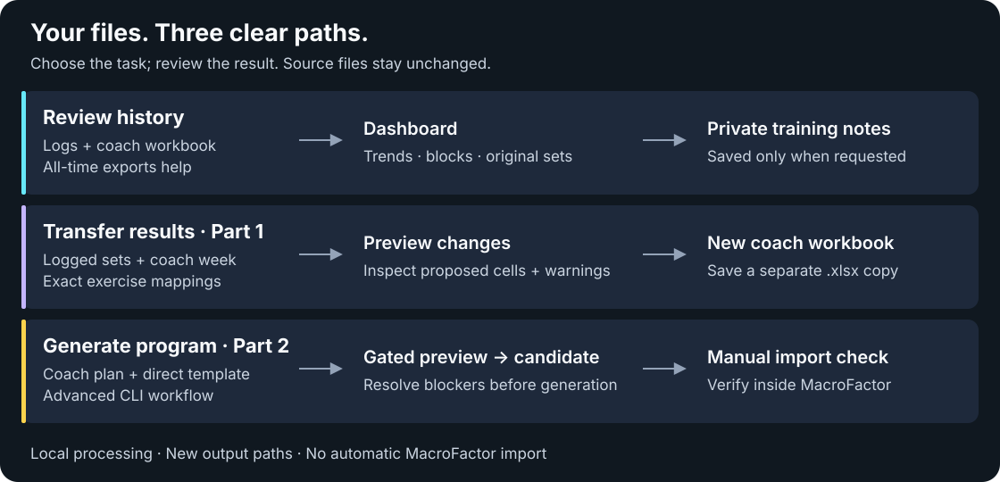

# MacroFactor Workout Bridge

[](https://github.com/joshuawyadao/MacroFactor-Workout-Bridge/actions/workflows/ci-verify.yml)
[](https://www.python.org/)
[](https://www.apple.com/macos/)
[](LICENSE)

Review your workout history and copy completed MacroFactor sets into a coach workbook, on your own Mac. The app keeps source files unchanged and shows proposed workbook updates before you save a new copy.

**Status:** Source-first personal utility for macOS 13+ on Apple silicon. No hosted backend or notarized download is provided. The optional CLI also offers gated coach-to-MacroFactor program generation.



## Choose your workflow

| I want to… | Start here | Result |
| --- | --- | --- |
| Set up the app for the first time | [Getting started](docs/Getting-Started.md) | A local app and private file workspace |
| Explore trends and record weekly feedback | [Desktop guide](docs/Desktop-Guide.md) | Read-only source analysis; explicitly saved local notes |
| Copy completed sets into a coach week (Part 1) | [Workbook transfer](docs/Desktop-Guide.md#update-a-coach-workbook) | A new coach `.xlsx` copy after preview |
| Use Terminal for transfers or file intake | [CLI reference](docs/CLI-Reference.md) | Explicit, repeatable commands |
| Create a MacroFactor program from a coach plan (Part 2) | [Program generation](docs/Program-Generation.md) | A candidate file requiring manual import verification |
| Contribute or understand the code | [Contributing](CONTRIBUTING.md) · [Architecture](docs/Architecture.md) | Module map, tests and development workflow |

## First run

You need Python 3.11+ for a local build, a MacroFactor **exercise-log** `.csv` or `.xlsx` export using pounds, and a coach `.xlsx` workbook. Python 3.11 is the documented baseline for the reviewed dependency locks. Using the built app requires no Python or Terminal.

From a checkout of this repository:

```sh
# Create a personal mapping once, then review its exact aliases.
cp -n config/exercises.example.json config/exercises.local.json

# Create the private folders and build the app.
PYTHONPATH=src python3 -m macrofactor_bridge.local_workspace setup
./scripts/build_macos_app.sh
```

Run the copy command only on first setup; preserve an existing personal mapping. Review it with the [configuration guide](docs/Configuration.md). The example uses synthetic exercise names and cannot match every personal workbook.

Put coach files in `local-data/inbox/coach/` and exercise logs in `local-data/inbox/macrofactor/`. Open **`dist/MacroFactor Workout Bridge.app`** in Finder. The app opens on **Dashboard** and normally loads those folders automatically. Use **Data → Choose workspace…** if it cannot find them.

For the complete walkthrough, supported-file checklist and a synthetic CLI trial, see [Getting started](docs/Getting-Started.md). A local build downloads pinned dependencies; subsequent app use has no runtime network integration.

## What protects your files

- **Preview before transfer.** The desktop shows proposed cells and warnings. The CLI has separate `preview` and `apply` commands; review the preview before invoking `apply`.
- **New output only.** Inputs stay unchanged; existing output files and occupied/formula result cells are protected. Changed inputs or transfer mappings require a fresh desktop preview.
- **Preserved workbooks.** Part 1 validates the candidate and preserves all unrelated workbook ZIP parts byte-for-byte. Only the selected worksheet and optional review-marker styles may change.
- **Exact mappings.** No fuzzy exercise matches or automatic equipment conversions. Ambiguous or unsupported results are reported. Yellow `Skip` cells are review prompts, not proof of a missed workout.
- **Local data.** History analysis does not change sources. Automatic intake archives copies; training notes save only when requested. Store private files in ignored locations and never force-add them to Git.

Read the [output and report safeguards](docs/Local-File-Workflow.md#preview-output-and-report-safety) for source checks, filesystem fallback behavior and concurrency limits. Archive history is not a backup service; back up your workspace separately.

## Supported scope

- Coach workbooks: `.xlsx`, with discoverable exercise/week headers and existing empty result cells. `.xlsm` and formula recalculation are unsupported.
- Exercise logs: `.csv` or `.xlsx` with `Weight (lb)` or `Weight (lbs)`; kilogram headers are unsupported.
- Dashboard: calendar trends, exact exercise variations, block comparisons and saved context. Block mapping requires confirmed valid dates; missing logs do not prove inactivity.
- Programs: CLI only, limited to structures verified by a direct program-export template. Automated validation does not prove that a new candidate imports into MacroFactor.
- Builds: locally ad-hoc signed, with no Developer ID signing or Apple notarization. Updating source does not update an installed app automatically.

## Documentation and help

[All guides](docs/README.md) · [Troubleshooting](docs/Troubleshooting.md) · [File storage and backup](docs/Local-File-Workflow.md) · [Exercise mappings](docs/Configuration.md) · [Development and verification](docs/Development.md)

Issues and pull requests are welcome; follow [CONTRIBUTING.md](CONTRIBUTING.md) and the [Code of Conduct](CODE_OF_CONDUCT.md). Use synthetic examples in public reports. Report vulnerabilities privately through the [Security Policy](SECURITY.md).

## License

Released under the [MIT License](LICENSE). This independent project is not affiliated with or endorsed by MacroFactor.
