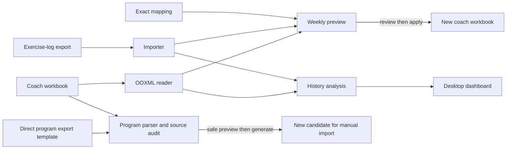
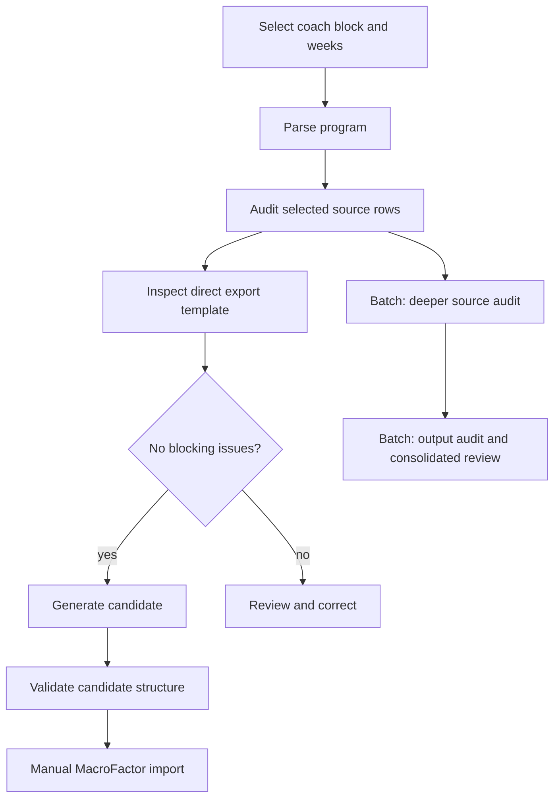

# Architecture

MacroFactor Workout Bridge is a local Python package with a Qt desktop app and a CLI. Its three workflows share strict parsing and workbook models, but have different write permissions: weekly transfer publishes a new coach workbook, history reads sources and explicitly saved private annotations, and program generation creates a candidate for manual MacroFactor import. See [Getting Started](Getting-Started.md) for use and [Development](Development.md) for building and testing.

## Data flows and safety boundary

In prose: an exercise-log export and coach workbook feed a read-only weekly preview; explicit apply writes a separate output. The same local sources feed history analysis and the dashboard. A selected coach program and direct MacroFactor program export template feed parsing and safety checks; successful generation creates a separate candidate, and import into MacroFactor remains manual. There is no hosted backend or runtime upload.

The weekly [service](../src/macrofactor_bridge/service.py) owns preview/apply checks: input hashes and the effective Part 1 mapping are rechecked, only existing empty result cells are eligible, and publication refuses the source or an existing output path. [OOXML handling](../src/macrofactor_bridge/ooxml.py) edits the chosen sheet XML and, for review highlights, styles XML, then checks untouched ZIP members for byte identity. [Reporting](../src/macrofactor_bridge/reporting.py) applies separate report-path safety rules. History analysis reads sources and explicitly saves private annotation JSON. Managed intake separately writes validated archive copies, manifests and current links; app preferences remember workspace and automatic-mode selection.

## Source map

All application modules live in `src/macrofactor_bridge/`. These groups are navigation aids, not separate Python packages.

| Area | Modules and responsibility |
| --- | --- |
| Entry points | [__main__.py](../src/macrofactor_bridge/__main__.py) launches [cli.py](../src/macrofactor_bridge/cli.py); [desktop.py](../src/macrofactor_bridge/desktop.py) is the Qt entry point; [__init__.py](../src/macrofactor_bridge/__init__.py) marks the package. |
| Weekly transfer | [importers.py](../src/macrofactor_bridge/importers.py) parses CSV/XLSX exercise logs and diagnostics; [workbook.py](../src/macrofactor_bridge/workbook.py) discovers coach sheets, weeks and target rows; [formatting.py](../src/macrofactor_bridge/formatting.py) formats completed sets and supersets; [service.py](../src/macrofactor_bridge/service.py) previews and safely applies. |
| Shared contracts and storage | [models.py](../src/macrofactor_bridge/models.py) defines transfer data and reports; [config.py](../src/macrofactor_bridge/config.py) validates mappings and program policy; [ooxml.py](../src/macrofactor_bridge/ooxml.py) reads/writes workbook package parts and checks integrity; [reporting.py](../src/macrofactor_bridge/reporting.py) validates and writes JSON reports. |
| Program source | [coach_program.py](../src/macrofactor_bridge/coach_program.py) discovers and parses coach blocks; [program_models.py](../src/macrofactor_bridge/program_models.py) carries cycles, prescriptions, issues and reports; [program_text.py](../src/macrofactor_bridge/program_text.py) applies explicit note cleanup policy; [program_audit.py](../src/macrofactor_bridge/program_audit.py) contains source audits. |
| Program generation | [program_service.py](../src/macrofactor_bridge/program_service.py) builds preview and gates single-program generation; [program_template.py](../src/macrofactor_bridge/program_template.py) inspects the direct export template, checks limits, writes a copy and validates it; [program_output_audit.py](../src/macrofactor_bridge/program_output_audit.py) checks output and import contracts; [program_batch.py](../src/macrofactor_bridge/program_batch.py) orchestrates multi-block review, generation and manual-import evidence. |
| Managed files and history | [local_workspace.py](../src/macrofactor_bridge/local_workspace.py) sets up, validates and archives inbox files; [managed_history.py](../src/macrofactor_bridge/managed_history.py) selects/consolidates snapshots; [history.py](../src/macrofactor_bridge/history.py) builds summaries and manages private annotations; [history_layout.py](../src/macrofactor_bridge/history_layout.py) resolves explicit week layouts; [progress.py](../src/macrofactor_bridge/progress.py), [comparison.py](../src/macrofactor_bridge/comparison.py), and [explorer.py](../src/macrofactor_bridge/explorer.py) derive chart, comparison and exercise-trend values. |
| Desktop presentation | [desktop_model.py](../src/macrofactor_bridge/desktop_model.py) prepares selectors and review text; [managed_desktop.py](../src/macrofactor_bridge/managed_desktop.py) loads managed history in background; [desktop_theme.py](../src/macrofactor_bridge/desktop_theme.py) styles controls; [history_navigation.py](../src/macrofactor_bridge/history_navigation.py), [explorer_view.py](../src/macrofactor_bridge/explorer_view.py), [comparison_view.py](../src/macrofactor_bridge/comparison_view.py), [timeline_view.py](../src/macrofactor_bridge/timeline_view.py), and [trend_chart.py](../src/macrofactor_bridge/trend_chart.py) render dashboard and analysis views. |

The [bundled mapping](../src/macrofactor_bridge/resources/exercises.example.json) is an example, not a private user configuration. [pyproject.toml](../pyproject.toml) declares entry points and optional dependencies. [packaging/](../packaging/) and [scripts/](../scripts/) hold the macOS build and test runner; [tests/](../tests/) uses synthetic or anonymized fixtures.

## Program gates

The single-program path calls `audit_program_source_rows` from `program_service.py` after parsing; it checks selected source rows even without batch mode. A direct export template must pass inspection and generation checks, and a preview with blocking issues cannot generate. Generation rechecks source/template hashes and validates the newly written workbook. Batch mode additionally calls `audit_coach_program` with complete week coverage, runs `audit_program_output` on generated candidates, consolidates review items, and records manual-import evidence without claiming automatic import success. See [Program Generation](Program-Generation.md) and [Program Batch](Program-Batch.md) for limits and operator steps.

The desktop exposes weekly transfer and read-only history. Program discovery, preview, generation and batch review are CLI workflows. Keep new behavior at these boundaries: parse and validate before writing, make uncertainty a review item, and require explicit output paths for generated files.
