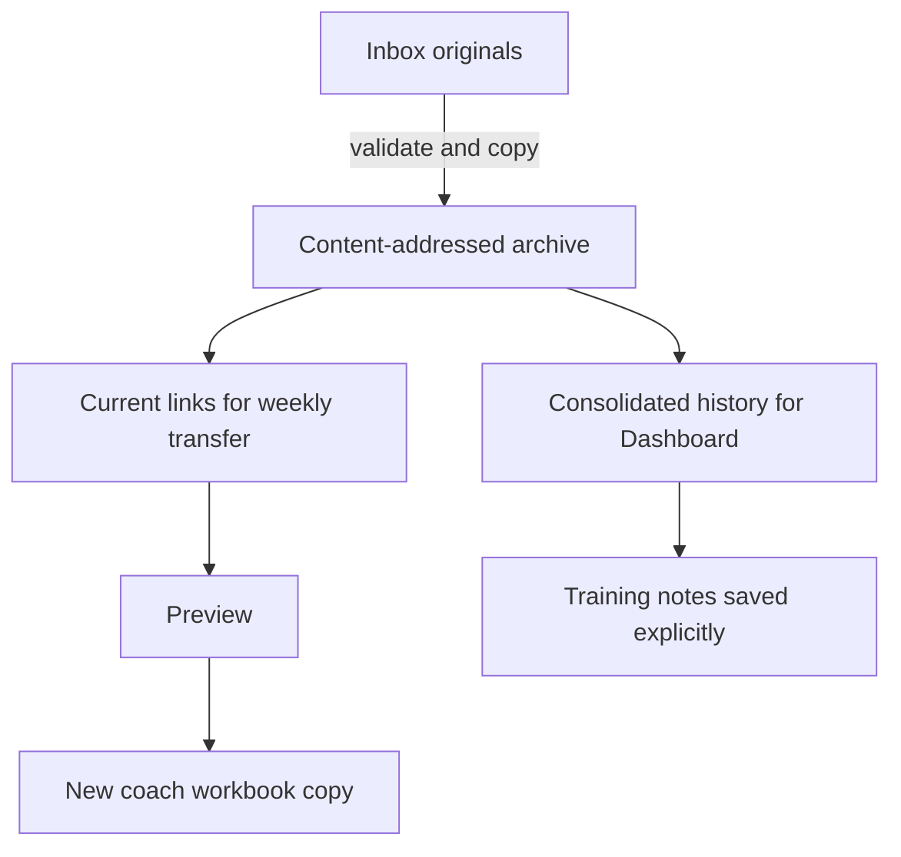

# Local File Workflow

[Documentation index](README.md) · [Project home](../README.md)

The project keeps personal workout files in `local-data/`, which is entirely excluded from Git. This provides a predictable place to drop new inputs and a local validation/version history without putting private workout data in repository history.

For first-time setup, follow [Getting started](Getting-Started.md). For app navigation, use the [Desktop guide](Desktop-Guide.md). This page explains where files live and how they are protected.



Intake preserves inbox files, archives validated copies and updates current shortcuts. Dashboard reconciles history across snapshots; weekly transfer uses selected inputs to make a new workbook. Notes have their own private file.

## Directory structure

```text
local-data/
├── inbox/
│   ├── coach/              # Drop new coach .xlsx workbooks here
│   └── macrofactor/        # Drop new exercise-log .csv or .xlsx exports here
├── archive/
│   ├── coach/              # Validated, consistently named workbook copies
│   └── macrofactor/        # Validated, date-range-named exercise-log copies
├── reference/
│   └── macrofactor-program/ # Optional direct Export Program reference; manually managed
├── current/                # Stable shortcuts to the inputs the app should use
├── generated/
│   ├── workbooks/          # Save completed coach workbook copies here
│   └── reports/            # Save preview/apply JSON reports here
├── annotations/            # Private workout-history block and week context
└── manifests/              # One validation manifest per archive run
```

Create or repair this structure at any time:

```bash
PYTHONPATH=src python3 -m macrofactor_bridge.local_workspace setup
```

After an editable install, `.venv/bin/macrofactor-workspace setup` is equivalent. If that environment is activated, the shorter command is:

```bash
macrofactor-workspace setup
```

Use `macrofactor-workspace --root /path/to/workout-data setup` for a custom location, and pass the same `--root` to `archive` and `status`. Setup and archive append managed-directory rules to the workspace's own `.gitignore` before creating data directories. Existing ignore content is preserved, and repeated setup is idempotent. This protects inboxes, archives, current links, generated files, annotations, and manifests even when the custom directory is inside a Git checkout. A symlinked `.gitignore` is refused rather than modified.

## Recurring workflow

Create and review `config/exercises.local.json` first using [Configuration](Configuration.md#create-your-private-configuration). Normal automatic app loading performs intake for you; the commands below are useful for explicit validation or CLI use.

1. Save the latest coach `.xlsx` file into `local-data/inbox/coach/`. Keep whatever filename the download already has.
2. Export the MacroFactor exercise log and save its `.csv` or `.xlsx` file into `local-data/inbox/macrofactor/`. There is no need to rename it.
3. Validate and archive everything currently in both inboxes:

   ```bash
   PYTHONPATH=src python3 -m macrofactor_bridge.local_workspace archive \
     --config config/exercises.local.json
   ```

4. Display the newest validated paths:

   ```bash
   PYTHONPATH=src python3 -m macrofactor_bridge.local_workspace status
   ```

5. To copy logged sets into a coach workbook, open MacroFactor Workout Bridge and choose the second top-level tab, **Update coach workbook**. Select `current/Coach Program - Current.xlsx` plus `current/MacroFactor Exercise Log - Current.csv` or `.xlsx`. These stable shortcuts are updated by the archive command. Click **Load workbook weeks**, select the worksheet and coach week, confirm the workout dates, then choose **Preview workbook changes**.
6. Click **Save updated workbook copy…** and save the new workbook under `local-data/generated/workbooks/`, with its JSON report under `local-data/generated/reports/`. Logged sets are copied into the selected week in this new workbook; the original workbook and export stay unchanged. This optional update is not required to use **Dashboard** or **Weekly feedback**.

## Updating the local app after a merge

For mapping-only calibration, update the private `config/exercises.local.json` beside the managed workspace after backing it up under `local-data/`. Keep previously confirmed aliases and exercise-specific conversions. Verify the selected sheet, labeled week and exact target rows in preview. Before the next transfer, explicitly select that private file in **Update coach workbook → Exercise mapping**, then load workbook weeks and create a fresh preview. Repeat this selection after every restart: the transfer tab starts with the bundled example mapping, even when Dashboard has automatically loaded the private workspace mapping. These configuration changes do not require an app rebuild. Keep private mappings and real workout validation reports out of commits. Generic regression fixtures should use invented workouts and loads.

Per-side conversions affect weight only; preserve logged repetitions. Machine labels requested for one week are entered manually, and base weight is not added. A workbook with already filled result cells is suitable for checking row matches but the transfer will correctly refuse to overwrite those results.

Merging a PR updates source code; it does not update an existing `.app`. To install the reviewed changes:

1. Save pending training notes and quit the app. Identify the bundle you normally open, and copy it to a private backup outside `dist/` before building.
2. Use a clean checkout containing the intended merged commit. Record that commit locally, then run `./scripts/build_macos_app.sh` from that checkout. The script rebuilds and verifies `dist/MacroFactor Workout Bridge.app`.
3. Check the new bundle's embedded Qt runtime:

   ```bash
   QT_QPA_PLATFORM=offscreen \
     "dist/MacroFactor Workout Bridge.app/Contents/MacOS/MacroFactor Workout Bridge" \
     --smoke-test
   ```

4. If your normal installation is elsewhere, copy the verified bundle to that existing app path. Replace only the `.app`; preserve `local-data`, the local exercise mapping, saved annotations, and app preferences. No data migration or settings reset is needed for this dashboard update.
5. Launch the installed copy. Confirm automatic loading and expected history coverage in **Source status…**. Check block dates in **Training notes**, chart trends, original-set drill-down, and existing **Weekly feedback**. Test saving and reopening feedback in a temporary workspace copy with isolated preferences, so acceptance checks do not add test notes to personal history. Keep the old bundle until these checks pass.

The smoke test creates a window without loading history; it does not verify real-data behavior. Version `0.9.1` / build `13` also appeared before the final PR review fixes, so version text alone does not identify the installed code. Retain the source commit and compare the built and installed executable hashes when recording an update. Keep app bundles, workspace copies, private validation reports, and screenshots out of Git and public uploads.

## Dashboard source selection and notes

The weekly `current/` export is selected separately from the Dashboard's broad-history baseline. New narrower exports can supplement history without erasing earlier coverage; conflicting day snapshots are flagged rather than concatenated. Read [automatic loading](Desktop-Guide.md#automatic-inbox-loading) and **Source status…** for selection details.

Normal training notes live in `annotations/workout-history.json`. The app saves them only on explicit request, pauses refresh for unsaved edits, and refuses to overwrite external changes. Prefer **Training notes** for ordinary edits. The following section is for advanced layouts only.

## Irregular coach week layouts

App version 0.4.1 supports an optional `week_layout` in each block's private annotation. Use it only after checking which source columns belong to that block. It is configured in JSON, not through a layout editor in the desktop app. Ordinary sheets still use automatically discovered numbered weeks in numeric order; **Update coach workbook** keeps its existing discovery behavior.

This synthetic example selects two normal headers and one date-labelled header, omitting any copied historical columns elsewhere in the worksheet:

```json
{
  "schema_version": 2,
  "blocks": {
    "Training Block": {
      "start_date": "2026-08-03",
      "week_layout": [
        {"label": "Week 10", "header_cell": "I3", "expected_header": "Week 10"},
        {"label": "Week 11", "header_cell": "K3", "expected_header": "Week 11"},
        {"label": "Week 12", "header_cell": "M3", "expected_header": "Train on 8/18"}
      ]
    }
  }
}
```

Array order is chronological, regardless of label numbering or column order. The first entry starts on the confirmed Monday `start_date`; each next entry starts seven days later. A non-Monday start remains editable but does not assign workouts to block weeks. Empty weeks remain in the calendar: absence of a logged workout does not shift dates, create a workout, mark a skip, or imply injury or fatigue. The block ends after its selected weeks; a worksheet title alone cannot add more weeks.

Each entry requires a unique non-empty label, an uppercase A1 header reference, and the exact header text (surrounding whitespace is ignored). A header must be a literal cell after the exercise header, anchored at the top left of its range if merged. Multi-row merged headers are supported, including single-column vertical merges. Results use the rightmost merged column, or the next column for an unmerged header. Duplicate result columns, results overlapping another selected header range, invalid anchors, missing configured sheets, and changed header text stop dashboard loading with a correction message.

Before editing, close the app and back up the annotation JSON privately. Preserve every existing block and week note; add the layout to the intended worksheet and set `schema_version` to `2`. Reload in version 0.4.1 or newer and verify selected week labels, counts, and date boundaries before saving further notes. Desktop block/week saves preserve the layout. Notes for excluded weeks remain stored but are not counted or shown in the selected-week editor. To correct a stale layout, inspect the current workbook and update the anchors/text deliberately; do not edit the source workbook just to satisfy the annotation.

Schema 1 files remain supported and remain schema 1 when saved without a layout. Files with layouts use schema 2, which older apps reject so they cannot silently discard this mapping. If reverting to an older app, restore the matching private annotation backup too; do not merely change the schema number. To return to automatic discovery in the new app, remove `week_layout` (or set it to `null`) and reload, understanding that copied numbered columns will be included again.

CLI-generated MacroFactor program workbooks also belong under `local-data/generated/workbooks/`, with private JSON reports under `local-data/generated/reports/`.

## Export context and archive behavior

When an `.xlsx` export contains MacroFactor's `Active Program` table, the preview reports non-empty exercise-level notes for exercises performed in the selected dates. This can carry context such as equipment choice or a misload explanation when entered in the exercise note. The current export's `Workout Log` table does not include program-level or session-level note columns, so those note types cannot be recovered. These are current active-program notes, not historical notes attached to the completed sets. Reported notes remain review-only and are never inserted into coach result cells automatically.

The archive command copies files; it never moves, changes, or deletes inbox files. An invalid file remains in the inbox, is recorded as an error in the run manifest, and is not copied into the archive.

An exercise-log export must contain at least one usable completed set: a non-empty exercise and set type, with a positive finite rep count. Mixed exports can still be archived when some rows are incomplete; supported row-level diagnostics remain visible in preview. Malformed dates or numeric values can instead reject the import, so not every invalid row is recoverable. Archival validation does not guarantee a matching, writable coach result cell.

Current and legacy MacroFactor pound exports are accepted through the exact `Weight (lb)` and `Weight (lbs)` header spellings. A weekly export can legitimately omit a workout because of its date window. When `workbook.empty_day_marker` is enabled, the bridge can place a yellow `Skip` review marker in the first available result cell of a programmed day with no matched session. The marker is not a MacroFactor skip record and must be confirmed during preview. It is withheld when unmatched, ambiguous, zero-rep, or otherwise unusable rows make the absence uncertain, and it never overwrites an existing result.

## Archive naming and recovery

The archive command derives names from validated content rather than the uploaded filename. Every name begins with the UTC upload/intake date so versions are easy to search by when they were added. MacroFactor exports also include the first and last workout dates present in the export. Both file types end with the first twelve characters of the SHA-256 content hash:

```text
2026-08-24--Coach-Program--59f565015e32.xlsx
2026-08-25--2026-08-18_to_2026-08-24--MacroFactor-Exercise-Log--a57f84bd0ed1.xlsx
```

Searching an archive folder for `2026-08-25` finds everything uploaded on that date. Different file contents create distinct versions even when Downloads adds names such as ` (2)` or the same downloaded filename is reused. An explicit CLI archive run reuses the first upload-dated copy for identical content and records the validation in a new manifest. An unchanged automatic refresh creates no empty manifest. The exact original upload name and every intake timestamp are retained in manifests for traceability.

The `current/` entries are relative symbolic links, so they do not duplicate the workbook data. The tool updates only links it manages and refuses to overwrite a regular file at one of those names. For MacroFactor, the current link chooses the export with the latest workout date; when two exports end on the same date, it prefers the one with the later starting date. The current coach link chooses the most recently modified validated workbook.

History selection skips malformed manifest entries, invalid workout ranges, missing or invalid timezone-aware modification timestamps, and archive copies whose hashes no longer match. One damaged entry does not prevent the remaining valid history from being used.

You can move or restore the whole workspace, including `archive/`, `manifests/`, and the relative `current/` links. History and status resolve managed archive names beneath the current workspace root, even when older manifests contain absolute paths from the original location. The original workspace is never used as a fallback. Traversal paths and links that escape the managed archive directory are excluded from history selection.

Each manifest records:

- the full SHA-256 hash and byte size;
- the original filename, modification time, inbox path, and archive path;
- whether an existing identical archive copy was reused;
- the canonical files selected by the stable current shortcuts;
- coach worksheet, exercise-header, and week discovery;
- MacroFactor row count, workout date range, and exercise count;
- validation errors for anything not archived.

This is local version history, not a backup service. Back up `local-data/` separately if protection against disk loss is important.

## Preview, output and report safety

Nonfinite weight/reps values remain visible as row/value diagnostics. The affected result cell is withheld, including shared superset cells, so a valid sibling set cannot produce a misleading partial result. Unaffected cells remain writable; missing bodyweight loads keep their established zero-load formatting. Invalid values suppress empty-day markers and are not rewritten in the export or raw importer provenance. Transfer multipliers must be finite and positive.

Part 1 previews retain workbook/export hashes and the effective transfer mapping. Apply rechecks the original mapping file as well as the supplied configuration; edits to program-only settings do not change Part 1 validity. A changed workbook, export or transfer mapping requires a new preview. Workbook candidates are staged beside the destination, validated for ZIP integrity and protected-input stability, then published without replacing an existing file. Failed validation removes the staged candidate rather than leaving a deliverable. Publication prefers an atomic hard link. On filesystems that do not support or permit hard links, the validated candidate is copied into an exclusively created file, then its identity, hash and protected inputs are rechecked. This fallback can be visible to other readers while copying; a failed copy or check compares file identity before attempting cleanup. Exclusive creation prevents overwriting an existing destination. Cleanup is best-effort against an external process replacing the path: portable identity-check and unlink operations are separate, so they do not provide atomic compare-and-delete protection. Avoid modifying an output path until the operation finishes.

Save JSON review reports to distinct new files. Desktop and CLI protect both reviewed and selected input/mapping paths and the generated workbook, reject existing files and symlink aliases, and refuse a destination created by another writer during saving. Reports contain private source paths and should stay in ignored local storage.

## Program files

Store candidate programs in `generated/workbooks/` and reports in `generated/reports/`. The optional `reference/macrofactor-program/` directory is manually managed and is not created or validated by workspace commands. It holds direct **Export Program** templates, which must stay out of the exercise-log inbox.

Follow [Program generation](Program-Generation.md) for single blocks and [Batch review](Program-Batch.md) for many blocks. Keep scoped configurations, manifests, reference hashes and manual import evidence private. Generated files remain candidates until their exact bytes have been manually tested in MacroFactor.

## Privacy and safety


- The whole `local-data/` tree is ignored by Git.
- Custom roots also receive workspace-local ignore rules for every managed data directory. Ignore rules do not remove files already tracked or prevent force-adding files; audit existing Git history separately if private data was previously committed.
- Personal exports, manifests, dashboard annotations, generated workbooks, and reports must not be force-added to Git.
- Direct MacroFactor program-export references and any derived private schema notes also remain local and must not be force-added to Git.
- Only MacroFactor exercise-log exports belong in the MacroFactor inbox. Program exports do not contain the required exercise-log table and will fail validation.
- Keep using Preview before creating output. Archival validation does not authorize or perform workbook writes.
- Treat every yellow `Skip` value as a review prompt. MacroFactor exercise-log exports do not distinguish a skipped day from an unlogged or out-of-range workout.
- The coach workbook and MacroFactor export selected by the app remain unchanged; output always uses a separate filename.
