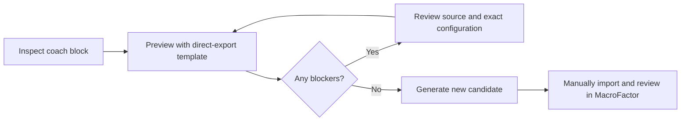

# Program generation (Part 2)

[Documentation index](README.md) · [Project home](../README.md)

Create a **new candidate program workbook** from a coach plan using the CLI. This is an advanced, gated workflow. The desktop app does not generate programs; a successful automated check does not establish that MacroFactor will import the file.

## Before you begin

- Complete [source setup](Getting-Started.md) and create a separate, ignored Part 2 mapping such as `config/program.local.json`. The commands below use that file so program decisions stay separate from weekly transfer mappings.
- Keep the coach `.xlsx` and a direct MacroFactor **Program Settings → Export Program** `.xlsx` locally. Exercise-log exports, granular Data Exports, Program Logs and an `Active Program` sheet are not substitutes for this template.
- Optionally create `local-data/reference/macrofactor-program/` for the template. Workspace setup does **not** create or manage that directory.
- Verify the coach's plan/result column direction before setting `program.week_pair_layout`. Keep raw reports and template evidence private.



Inspect the block, preview its prescriptions, resolve blockers, then generate a new file and verify it manually in MacroFactor. For many blocks, use [batch review](Program-Batch.md).

**On this page:** [Inspect and preview](#inspect-and-preview) · [Base programs and duration](#initial-base-program-and-workout-names) · [Reviewed corrections](#reviewed-corrections-and-concise-notes) · [Sequential expansion](#reviewed-sequential-exercises-from-one-row) · [Import policies](#other-import-policies) · [Generate](#generate-a-candidate).

## Inspect and preview

Part 2 begins with a separate, read-only preview path. It discovers repeated day sections and uses the explicit `program.week_pair_layout` setting (`plan_then_result` or `result_then_plan`) to identify planned and completed-result columns within each structurally proven week pair. Without that setting, no week is considered safe to preview. The parser never reads the configured completed-result column as a prescription.

List selectable worksheets, program blocks, days, and safely separated weeks:

```sh
PYTHONPATH=src python3 -m macrofactor_bridge program-inspect \
  --workbook "/path/to/Coach_Program.xlsx" \
  --config config/program.local.json
```

Preview one or more included weeks and optionally save a private JSON report:

```sh
PYTHONPATH=src python3 -m macrofactor_bridge program-preview \
  --workbook "/path/to/Coach_Program.xlsx" \
  --config config/program.local.json \
  --template local-data/reference/macrofactor-program/template.xlsx \
  --sheet "Selected worksheet" \
  --block block-1 \
  --week "Week 1" \
  --week "Week 2" \
  --report local-data/generated/reports/program-preview.json
```

Report paths must be new files and cannot reuse an input, mapping or generated workbook path; both desktop and CLI refuse to overwrite an existing report.

The preview contains discovered days and exercises, exact mapping outcomes, per-cycle set count/type/reps/RIR/rest, source-cell and raw-text provenance, proposed configuration defaults, explicit exclusions, custom or unavailable MacroFactor exercises, supersets, skipped items, blockers, source and template hashes, schema-verification state, and whether generation is safe. Omitting `--template` keeps the preview available but adds a blocking missing-template issue.

Parsing is deliberately allow-listed. Base sets must be positive integers. Reps can be a single value, a range such as `8-12`, `8 to 12 reps`, `8 to 12 range`, or `8 to 12 rep range`, or a comma-separated positive per-set list whose length matches the set count. Single numbers become equal minimum/maximum targets. Explicit `ea`/`each` suffixes (optionally `leg`/`side`) mean per-side reps; a trailing `again` or `here` preserves the preceding exact target. Those suffixes must be terminal: additional prose remains uninterpreted. `N+ reps` has a minimum but no maximum: native generation remains blocked until a direct export verifies minimum-only encoding, unless the user explicitly enables the notes-only fallback below. Rest needs an explicit seconds or minutes unit. Weekly cells may use compact instructions such as `3 x 8-10 @ 2 RIR, 120 sec rest`. `Read week`, `your choice`, RPE, AMRAP, weights, substitutions and progression prose remain raw and blocking unless an explicit notes/blank policy applies.

An independent source-row scan checks each selected day through the next day heading, including rows after blank separators. Unaccounted exercise rows, orphan base prescriptions and base formulas block standalone generation in both base and selected-week modes. Intentional week subsets remain supported. Reviewed reference boundaries may be supplied through the batch manifest or service API; standalone CLI generation blocks ambiguous footer content pending review.

The coach `Style` column is preserved as raw classification text. The separate `Variation` column is retained and used for exact exercise matching and context. A specific variation must match an exact alias/canonical name or a category alias with matching configured context; an unqualified category mapping from another block cannot replace it. A single block-wide week header may serve later days with matching base columns and proven plan/result pairs. Header inheritance stops when day numbers reset or the base layout changes.

Within a discovered day, the exercise table begins at the first exercise and ends when all base columns are blank. Standalone weekly footer notes do not extend the exercise table into later reference sections. Review discovered boundaries before generation; the independent scan described above still checks beyond the first separator.

The optional top-level `program.defaults` object can propose rep, RIR, and rest values. Defaults are disabled by `null`, never replace coach-provided values, and are labeled `config_default` in preview. Rep defaults require both `rep_min` and `rep_max`. Set `program.week_pair_layout` only after verifying whether each week pair is planned-then-result or result-then-planned in that coach workbook.

## Initial base program and workout names

Use `program.prescription_source: "base"` when the left-hand table defines the initial program and weekly coach updates will be handled separately. Each selected week adds one cycle repeating the base prescription. Omitting `--week` in this mode selects all safely discovered weeks in the chosen block; explicit `--week` arguments limit the duration. The CLI prints the source mode and cycle count. Weekly coach text stays in the private report with `weekly_update_not_applied` warnings, but cannot supply targets, set types, mapping context, exclusions or exported notes. Completed results are never prescription inputs. This is a repeated base program, not automatic weekly progression. The default `"selected_week"` mode retains existing conflict checks.

For a reviewed base block with **no literal week headers at all**, optional `program.base_cycle_count` can supply an explicit duration from 1 through 52. Discovery exposes neutral `Cycle 1` … `Cycle N` labels; prescriptions still come only from the base table, and unlabeled cells to the right are not treated as coach weeks or completed results. The option requires base mode and the default intersection header policy. It is not a fallback for partial, unsafe, formula-driven or conflicting week headers; those blocks remain unavailable rather than being reinterpreted.

Optional `program.exclude_empty_days: true` omits only day headings that have no coach-authored base-table content through the next day heading or reviewed final-day reference boundary. Preview records one warning and skipped item per omitted heading, while populated days and days whose rows are all explicitly excluded remain visible. Exported workout order is renumbered without changing the source day labels. The default is false.

Set `program.use_day_designations: true` to name exported workouts from the unique text beneath each day heading in the same discovered column. The report preserves the original identifier (including fractional days), full designation and source cell. No sheet, row or column is hard-coded. Missing designations use the original label; ambiguous or formula-driven designations warn and fall back without borrowing another day's title.

## Reviewed corrections and concise notes

`program.notes_mode: "concise"` with `preserve_coach_notes: true` omits redundant structured-field dumps and import-setting boilerplate from exported notes. The private report still retains source values, weekly text and policy provenance. Unresolved targets and unilateral cues remain in notes. Exact-rule `program_notes` can supply a reviewed list of residual technique/equipment cues (an empty list removes redundant variation text). This replaces only the variation note, not unresolved target guidance. Without that list, unmatched variation wording is retained conservatively. The default `"full"` mode is unchanged.

Optional `program.note_text_policy: "conservative"` improves only the exported exercise-note presentation. It collapses stray whitespace, corrects a small reviewed allow-list of unambiguous spelling mistakes, normalizes common workout abbreviations such as AMRAP/RIR/RPE/BSS, capitalizes the note, adds terminal punctuation and closes unmatched opening parentheses. It does not use fuzzy spell checking, infer a prescription, rename an exercise or alter URLs. The preview/report retains the exact coach cell text and source-cell provenance. The backward-compatible default is `"verbatim"`.

`program.minimum_rep_policy: "notes_only"` requires both `allow_blank_targets: true` and `preserve_coach_notes: true`. Exact `15` still exports as `15 - 15`; a minimum such as `15+ reps` instead has **blank rep targets** and an explicit exercise note retaining the original text for manual entry. Preview marks this policy with `minimum_reps_in_notes`, retains raw text and identifies the blanks as policy choices. Reviewed concise notes cannot remove this guidance. Defaults do not supply an invented maximum, and weekly conflicts still block. The default policy is `"block"`. This fallback is not native minimum-only support.

Optional `program.color` and `program.icon` override uniquely discovered template metadata cells. Omit them (or use null) to preserve the template. Currently verified override tokens are colors `Orange`/`Red` and icons `Chess Pawn`/`Rocket`, observed in direct exports—not a complete app catalog. For example, `"color": "Red", "icon": "Rocket"` provides a consistent growth-program theme. Preview identifies configured overrides; missing or ambiguous metadata and unverified override values block. No workbook styles are recolored, and the production runtime remains Python/OOXML. Confirm the displayed appearance during manual import.

Keep corrections in a block-specific ignored Part 2 configuration, separate from Part 1. An exercise rule may use `program_include_warmup: true` for an explicitly reviewed warmup-classified strength exercise. It does not bypass cardio, mapping, custom-exercise, set-type or template checks, and cannot accompany `program_excluded: true`.

For a reviewed base-cell correction, `program_base_overrides` accepts only `sets` and `reps`, with both an exact `expected` source string and a supported replacement `value`:

```json
"program_base_overrides": {
  "sets": {"expected": "2", "value": "4"},
  "reps": {"expected": "See instructions", "value": "7-11"}
}
```

Corrections carry `config_reviewed_override` provenance and warnings. A changed source string blocks as `stale_base_override`; unsupported replacements remain blocked even with blank-target policy. Date-formatted rep cells still require human review rather than interpreting a date serial as reps. No correction changes the coach workbook.

## Reviewed sequential exercises from one row

In base-prescription mode, one exact exercise rule can explicitly expand a combined coach row into **two independent, ordered exercises**. Each child requires its own exact MacroFactor name and positive set count; the count is for that child, not a total to divide. Keep this block-specific configuration private:

```json
"program_expansion": {
  "expected_variation": "Coach combined movement",
  "expected_sets": "2",
  "exercises": [
    {"canonical": "Synthetic First", "sets": 2},
    {"canonical": "Synthetic Second", "sets": 2}
  ]
}
```

Both guards must match literal source text exactly. Preview retains the original row/cells/raw text, reports `exact_expansion`, child order and `config_program_expansion` set-count provenance, and shows a review warning. Shared rep/rest/RIR targets and notes are preserved. No superset is inferred. Stale/formula-driven guards, per-set rep lists, special-set sequences and source supersets block rather than allocating them. Configured supersets, set-count overrides and inclusion/exclusion exceptions cannot accompany expansion. Optional child `macrofactor_custom`/`macrofactor_available` booleans retain the existing warning/blocking behavior; specify these on each child, not the parent. Child names do not enter Part 1's result alias index.

## Other import policies

For an import that carries coaching instructions in notes and leaves unspecified targets editable, these opt-in settings are available:

```json
{
  "program": {
    "week_pair_layout": "plan_then_result",
    "sheet_order": "right_to_left",
    "rest_range_policy": "upper",
    "set_count_range_policy": "upper",
    "allow_blank_targets": true,
    "preserve_coach_notes": true,
    "exclude_warmups": true,
    "exclude_cardio": true,
    "resize_template_workouts": true,
    "defaults": {"set_type": "standard"}
  }
}
```

`right_to_left` lists the last worksheet first; it does not infer dates from worksheet names. All discovered days and optional exercises remain included unless explicitly excluded. `upper` selects the upper end of an exact rest range and identifies that choice in field provenance and notes. `allow_blank_targets` leaves missing reps, RIR, and rest blank when no explicit configured default is present. With `preserve_coach_notes`, `Read week` rep instructions remain deferred, unsupported rep instructions stay in notes with blank targets, and full base/selected-week coaching text is retained in the template's exercise Notes field. RPE is never converted to RIR. Bare numbers in weekly cells are retained as instructions rather than interpreted as rep targets, because they may be weights. Excel date-formatted rep cells are flagged and never emitted as serial-number rep targets.

`set_count_range_policy: "upper"` selects the upper end of an exact base set-count range such as `2–3` or `3 to 4 sets`. The preview labels that choice `coach_range_upper_by_policy`; Notes retain the original range and selected total when notes are enabled. Exact weekly set counts still undergo conflict checking, and the total must fit the verified template's set capacity. Malformed ranges and prose remain blocked. The default policy is `"block"`.

`unitless_rest_policy: "seconds"` explicitly interprets positive integers in the **base Rest column** as seconds. The default remains `"block"`. Unitless ranges additionally require `rest_range_policy: "upper"`. Preview preserves the source cell/raw value, emits a policy warning, and uses distinct `coach_unitless_seconds_by_policy` or `coach_unitless_seconds_range_upper_by_policy` provenance. Explicit minute/second units take precedence; weekly bare numbers never inherit this policy. Repeated-unit ranges such as `75 sec to 105 sec` and exact ceilings such as `120 sec max` are supported; mixed units, reversed ranges and arbitrary prose remain blocked. Ceiling and `(timed)` cues survive concise exercise notes.

Literal unilateral set counts such as `2 each leg` mean two sets per side, not four. They retain coach-source provenance and a per-side note. A configured native superset gives **each movement** the full resolved count; combined text alone does not choose exercise identities or establish membership/order. Previously reviewed sequential `program_expansion` rules remain sequential.

The standard-set default is explicit and visible. Myo/drop/superset instructions override the default and stay subject to verified template support; explicit configured superset membership supplies the group and order. Unresolved exercise identities and conflicting exact values remain blockers. These settings do not change Part 1 or weaken the strict parser configuration used by existing workflows. Part 1's `+` formatting for completed myo-rep results is not a native program set-type encoding.

A second direct export verifies the literal `Myo Set` value alongside `Standard Set`. An exact exercise rule can now specify the ordered types and an explicit blank rep-target policy:

```json
{
  "canonical": "Exact MacroFactor exercise name",
  "coach_aliases": ["Exact coach exercise alias"],
  "program_set_types": ["standard", "myo", "myo"],
  "program_blank_rep_targets": true
}
```

The sequence must match the resolved total set count; there is no automatic padding or truncation. Preview reports each set type with `config_set_sequence` provenance. Blank rep overrides require `program.preserve_coach_notes: true` so original targets and instructions remain in exercise Notes. The generator uses actual `Myo Set` cells, not `+` text or standard-set placeholders. Without an explicit sequence, ambiguous myo instructions remain blocked. Drop-set encoding and combining mixed set types with supersets remain unsupported.

Part 2 reuses each exercise rule's exact `coach_aliases` and `canonical` MacroFactor name. These optional fields add review behavior without changing Part 1:

```json
{
  "program_excluded": true,
  "program_exclusion_reason": "Handled outside the strength program import",
  "macrofactor_custom": false,
  "macrofactor_available": true
}
```

`superset_group` and contiguous `superset_order` values starting at 1 define explicit Part 2 membership. A shared coach alias expands only when every exact match forms one complete ordered superset, and each selected day must contain every configured, non-excluded group member exactly once; otherwise preview blocks instead of guessing.

## Generate a candidate

Generate only after a template-aware preview reports no blocking items:

```sh
PYTHONPATH=src python3 -m macrofactor_bridge program-generate \
  --workbook "/path/to/Coach_Program.xlsx" \
  --config config/program.local.json \
  --template local-data/reference/macrofactor-program/template.xlsx \
  --sheet "Selected worksheet" \
  --block block-1 \
  --week "Week 1" \
  --week "Week 2" \
  --output local-data/generated/workbooks/macrofactor-program.xlsx \
  --report local-data/generated/reports/program-generation.json
```

The generator writes only to a new `.xlsx` path. It rechecks both inputs after preview, preserves their bytes, retains the template worksheet layout and formatting, rebuilds shared strings so replaced template content is not carried forward, and verifies every unrelated OOXML package member byte-for-byte.

The verified export proves one repeated cycle layout, including active sets with blank rep, RIR, and rest targets. Generation requires all selected coach weeks or explicitly configured base cycles to resolve to identical set count, ordered types, rep range, RIR, rest, and notes for each exercise. The included day count must fit the guarded template-resize policy and sets must fit its discovered capacity. Provided RIR values must be integers from 0 through 6; blank targets require explicit policy provenance. Standard sets, explicitly configured standard/myo sequences, and separately grouped standard supersets are writable. A program with different cycle prescriptions or drop-set encoding needs a direct export demonstrating that structure before support can be implemented.

The small mixed-set reference omits rep-range columns when all targets are blank. It proves the type values but is not a full-layout generation template: the current generator still requires Type, Rep Range, RIR and Rest columns for each set and merged workout groups. Keep using a verified full-layout template for the candidate. Compatibility remains unverified until the user manually imports the generated file into MacroFactor.

By default, per-day exercise counts must also match the template. Opt-in `resize_template_workouts` can resize existing contiguous workout row groups and remove unused **trailing** workout groups while preserving headers, set columns, row styles, and workout-label merges. It cannot add days, remove a middle group, add/remove set columns, or reorder template groups, and requires at least two source and target exercises per retained day. Templates with formulas, defined names, trailing rows, non-workout body merges, or unsupported worksheet features are refused. Resized outputs undergo the same structural round-trip, semantic output audit and unrelated-member integrity checks.

The generated workbook remains unverified for MacroFactor compatibility until it imports successfully through **New Program → Import From File**. Structural validation does not confirm import compatibility; verify each candidate in MacroFactor before relying on it.

## Revising a reviewed decision

Keep exact mapping choices, overrides and evidence in private block-specific profiles. When withdrawing a correction, remove only that field from `program_base_overrides` (or remove the empty object); preview should return to `coach_base` provenance. Generate to a new path and verify surplus set slots clear and unrelated prescriptions stay unchanged. Leave the previously approved profile and output available for comparison.

Review cue-only variations using an evidenced exercise identity, retaining tempo, pause, speed and setup cues in exercise Notes. Material equipment, body-position or injury substitutions still need an explicit choice. Check every row matched by a rule; similarity alone does not authorize an alias. The verified template has exercise Notes, with no assumed program/session-note fields.

See [configuration](Configuration.md) for shared mapping fields, [batch review](Program-Batch.md) for private scoped profiles and import evidence, and [troubleshooting](Troubleshooting.md#program-generation) for common blockers.
